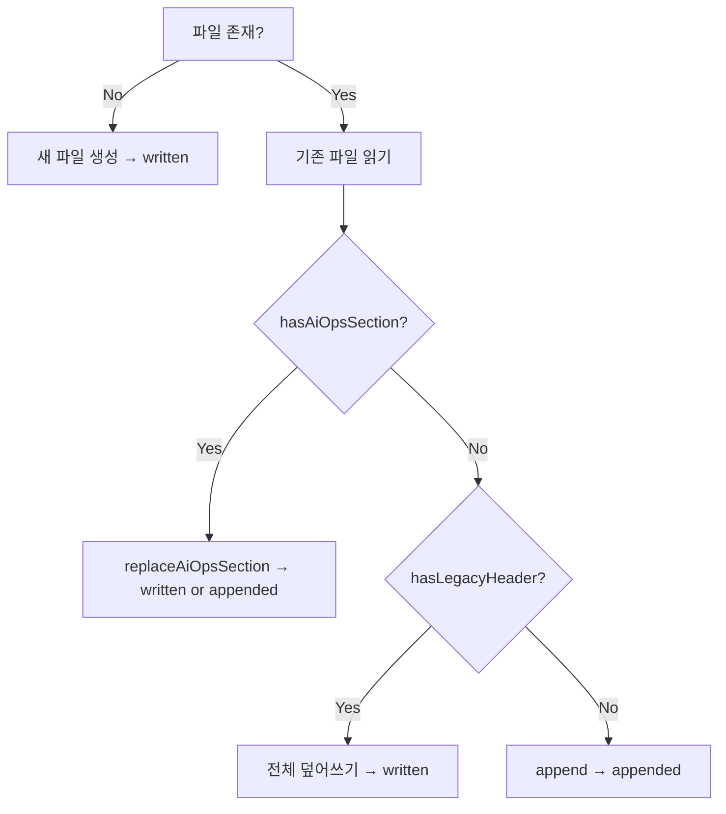
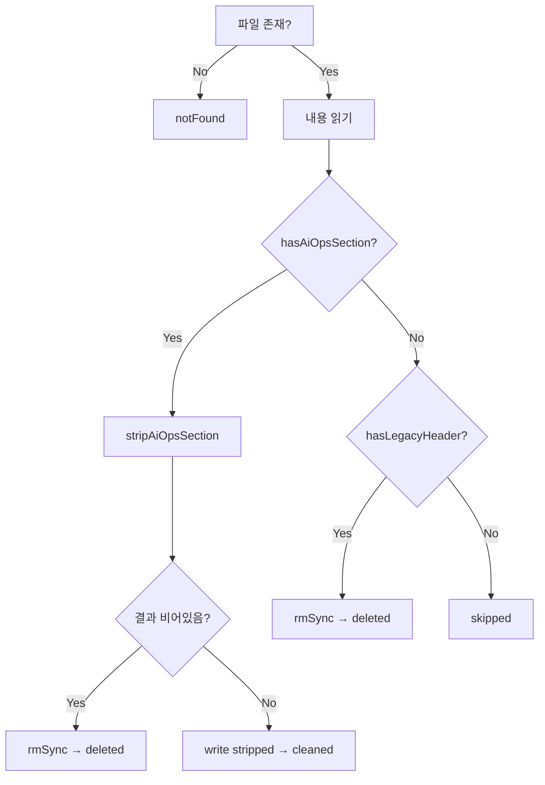

# Uninstall 버그 수정 + 마커 시스템 통합

## Context

두 가지 버그와 하나의 리팩터링을 함께 처리:

1. **Rule 파일 uninstall 버그**: 사용자가 managed 파일 위에 콘텐츠를 추가하면 `isManagedFile` 실패 → skipped 처리
2. **Settings JSON uninstall 버그**: JSON 파일은 markdown marker가 없어 항상 skipped
3. **마커 시스템 통합**: `wrapWithHeader` (end marker 없음) + `wrapWithSection` (start/end) → `wrapWithSection` 하나로 통일

마커 통합으로 bug 1이 근본적으로 해결됨: 모든 ai-ops 콘텐츠가 start/end 경계를 갖게 되어 위치와 무관하게 정확히 제거 가능.

## 마커 통합 설계

### 통합 포맷: `<!-- ai-ops:start -->` / `<!-- ai-ops:end -->` 재사용

```
<!-- ai-ops:start -->
<!-- sourceHash: a1b2c3 | generatedAt: 2026-03-08T00:00:00.000Z -->

# 콘텐츠 ...

<!-- ai-ops:end -->
```

### 핵심 변경: install 흐름

현재: `buildInstallPlan`이 `wrapWithHeader` 적용 → `install.ts`가 non-managed 파일이면 header strip 후 `wrapWithSection`으로 re-wrap

통합 후: `buildInstallPlan`이 `wrapWithSection` 적용 → `install.ts`가 `action.content`를 그대로 사용



### 핵심 변경: uninstall 흐름



## 변경 파일 목록

### 1. `apps/cli/src/core/managed-header.ts`

**제거 함수:** `wrapWithHeader`, `isManagedFile`, `containsManagedMarker`, `stripManagedBlock`, `parseManagedHeader`, `stripManagedHeader`

**추가 함수:**

- `hasLegacyHeader(content)`: `content.includes('<!-- managed by ai-ops -->')` — 하위 호환 감지
- `parseAiOpsMeta(content)`: 블록 내 start marker 다음 줄에서 sourceHash/generatedAt 추출

**유지 함수 (변경 없음):** `wrapWithSection`, `hasAiOpsSection`, `stripAiOpsSection`, `replaceAiOpsSection`

### 2. `apps/cli/src/core/install-plan.ts`

- `import { wrapWithHeader }` → `import { wrapWithSection }` (from `./managed-header.js`)
- `wrapWithHeader(content, meta)` → `wrapWithSection(content, meta)` (3곳)

### 3. `apps/cli/src/commands/init.ts`

- `wrapWithHeader` import 제거, `wrapWithSection` import 추가
- monorepo codex/gemini 분기의 `wrapWithHeader` → `wrapWithSection` (2곳)

### 4. `apps/cli/src/commands/update.ts`

- `wrapWithHeader` import 제거, `wrapWithSection` import 추가
- monorepo codex/gemini 분기의 `wrapWithHeader` → `wrapWithSection` (2곳)

### 5. `apps/cli/src/lib/install.ts`

기존 4분기 → 3분기로 단순화:

```typescript
// imports: hasAiOpsSection, replaceAiOpsSection, stripAiOpsSection, hasLegacyHeader

if (!existsSync(absPath)) {
  // 새 파일 생성
  mkdirSync(dirname(absPath), { recursive: true });
  writeFileSync(absPath, action.content, 'utf-8');
  written.push(action.relativePath);
} else {
  const existing = readFileSync(absPath, 'utf-8');

  if (hasAiOpsSection(existing)) {
    // 기존 블록 교체 (사용자 콘텐츠 자동 보존)
    const updated = replaceAiOpsSection(existing, action.content);
    writeFileSync(absPath, updated, 'utf-8');
    const stripped = stripAiOpsSection(existing);
    (stripped.trim().length > 0 ? appended : written).push(action.relativePath);
  } else if (hasLegacyHeader(existing)) {
    // 레거시 → 새 형식으로 덮어쓰기
    writeFileSync(absPath, action.content, 'utf-8');
    written.push(action.relativePath);
  } else {
    // 순수 사용자 파일 → 최초 append
    const updated = existing.trimEnd() + '\n\n' + action.content + '\n';
    writeFileSync(absPath, updated, 'utf-8');
    appended.push(action.relativePath);
  }
}
```

**제거 imports:** `isManagedFile`, `wrapWithSection`, `stripManagedHeader`
**추가 imports:** `hasLegacyHeader`

### 6. `apps/cli/src/lib/uninstall.ts`

3분기 → 2분기 통합:

```typescript
// imports: hasAiOpsSection, stripAiOpsSection, hasLegacyHeader

if (hasAiOpsSection(content)) {
  const stripped = stripAiOpsSection(content);
  if (stripped.trim().length === 0) {
    rmSync(absPath);
    deleted.push(rel);
  } else {
    writeFileSync(absPath, stripped, 'utf-8');
    cleaned.push(rel);
  }
} else if (hasLegacyHeader(content)) {
  rmSync(absPath);
  deleted.push(rel);
} else {
  skipped.push(rel);
}
```

**제거 imports:** `isManagedFile`, `containsManagedMarker`, `stripManagedBlock`
**추가 imports:** `hasLegacyHeader`

### 7. `apps/cli/src/core/index.ts`

export 변경 없음 (`export * from './managed-header.js'`가 자동 반영)

### 8. `apps/cli/src/lib/deep-merge.util.ts` (이미 생성됨)

변경 없음.

### 9. `apps/cli/src/lib/claude-settings.ts` (이미 수정됨)

변경 없음 — `uninstallClaudeSettings` + `deepMerge` import 교체 완료.

### 10. `apps/cli/src/lib/gemini-settings.ts` (이미 수정됨)

변경 없음.

### 11. `apps/cli/src/commands/uninstall.ts` (이미 수정됨)

변경 없음 — settings 처리 + SETTINGS_PATHS 필터 완료.

### 12. `apps/cli/src/commands/init.ts`

settings 경로 `allInstalledFiles.push` 제거는 이미 완료. `wrapWithHeader` → `wrapWithSection` 교체 추가 필요.

## 테스트 변경

### `apps/cli/src/core/__tests__/managed-header.test.ts`

- `wrapWithHeader` 테스트 → `wrapWithSection`이 동일 역할을 하므로, 기존 section 테스트가 커버
- `isManagedFile` / `parseManagedHeader` / `stripManagedHeader` 테스트 삭제
- `hasLegacyHeader` 테스트 추가
- `parseAiOpsMeta` 테스트 추가

### `apps/cli/src/__tests__/install.test.ts`

- `wrapWithHeader` → `wrapWithSection` 교체
- "non-managed 파일 append" 테스트의 검증 로직 유지 (start/end 마커 확인)
- 레거시 파일 마이그레이션 테스트 추가

### `apps/cli/src/__tests__/uninstall.test.ts`

- `writeManaged` 헬퍼: `wrapWithHeader` → `wrapWithSection`
- "managed marker 중간" 테스트 → "블록만 있는 파일 → deleted" / "블록 + 사용자 콘텐츠 → cleaned"로 재작성
- 레거시 파일 uninstall 테스트 추가

### `apps/cli/src/__tests__/e2e.test.ts`

- `isManagedFile(content)` → `hasAiOpsSection(content)` 교체

### `apps/cli/src/core/__tests__/install-plan.test.ts`

- `isManagedFile(action.content)` → `hasAiOpsSection(action.content)` 교체

### `apps/cli/src/__tests__/deep-merge.test.ts` (이미 생성됨)

변경 없음.

## 하위 호환

- `hasLegacyHeader`: `<!-- managed by ai-ops -->` 마커가 있는 기존 파일 감지
- install: 레거시 파일 → 새 형식으로 덮어쓰기 (update 실행 시 자동 마이그레이션)
- uninstall: 레거시 파일 → 삭제

## 검증

1. `npm run build` — 컴파일 확인
2. `npm test` — 전체 테스트 통과
3. 수동 E2E: `ai-ops init` → rule 파일에 사용자 콘텐츠 위/아래 추가 → `ai-ops uninstall` → 사용자 콘텐츠만 보존
4. 수동 E2E: `ai-ops init` (settings 포함) → settings.json에 사용자 키 추가 → `ai-ops uninstall` → ai-ops 키만 제거
