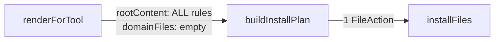

# 단일레포 codex/gemini: 모든 룰을 단일 파일로 통합

## Context

현재 단일레포에서 codex/gemini는 global 룰과 domain 룰을 **별도 파일**로 생성한다:

| Tool   | Global rules        | Domain rules                     |
| ------ | ------------------- | -------------------------------- |
| codex  | `AGENTS.md`         | `AGENTS.override.md`             |
| gemini | `.gemini/GEMINI.md` | `./GEMINI.md` (루트에 별도 파일) |

**문제:** 두 도구 모두 단일레포에서는 하나의 파일에 모든 룰이 들어가야 한다:

- codex → `AGENTS.md` 하나
- gemini → `.gemini/GEMINI.md` 하나

## 변경 전략: `renderForTool`만 수정

파이프라인 `renderForTool → buildInstallPlan → installFiles`에서 **`renderForTool`만** 변경하면 된다.

`buildInstallPlan`은 이미 `domainFiles`가 빈 배열이면 root 파일 하나만 생성하는 로직이 있으므로, `renderForTool`에서 단일레포일 때 모든 룰을 `rootContent`에 합치고 `domainFiles = []`로 반환하면 자연스럽게 단일 파일이 된다.



## 수정 파일

### 1. `apps/cli/src/core/renderer.ts` (lines 159-176)

**Before (단일레포 분기):**

```ts
const { global, domain } = partitionRules(rules);
const rootContent = renderRulesToMarkdown(global);

if (!workspaceMappings || workspaceMappings.length === 0) {
  const domainMarkdown = renderRulesToMarkdown(domain);
  domainFiles = domainMarkdown ? [{ workspacePath: '.', content: domainMarkdown }] : [];
}
```

**After:**

```ts
if (!workspaceMappings || workspaceMappings.length === 0) {
  // 단일 프로젝트: 모든 룰(global + domain)을 rootContent 하나로 합침
  const rootContent = renderRulesToMarkdown(rules);
  const domainFiles: { workspacePath: string; content: string }[] = [];

  if (toolId === 'codex') return { tool: 'codex', rootContent, domainFiles };
  return { tool: 'gemini', rootContent, domainFiles };
}

// 모노레포: 기존 로직 유지 (global → rootContent, domain → workspace별 파일)
const { global, domain } = partitionRules(rules);
const rootContent = renderRulesToMarkdown(global);
// ... 이하 모노레포 로직 동일
```

핵심: 단일레포일 때 `partitionRules`를 호출하지 않고 전체 rules를 `renderRulesToMarkdown(rules)`로 합친다.

### 2. `apps/cli/src/core/__tests__/renderer.test.ts`

- `codex: rootContent에 global만, domainFiles에 domain만` → 단일레포: rootContent에 global+domain 모두 포함, domainFiles 비어있음
- `gemini: rootContent에 global만, domainFiles에 domain만` → 동일하게 수정
- 스냅샷 업데이트 필요

### 3. `apps/cli/src/core/__tests__/install-plan.test.ts`

- codex 단일레포 테스트: `domainFiles: [{ workspacePath: '.', content: '...' }]` → `domainFiles: []`로 변경 (renderForTool이 이미 합쳐서 내려주므로)
- gemini 단일레포 테스트: 동일하게 수정
- 모노레포 테스트는 변경 없음

### 4. `apps/cli/src/core/tool-output.ts` — 변경 없음

`TOOL_OUTPUT_MAP`의 `domainFileName` 설정은 모노레포에서만 사용되므로 그대로 둔다.

## 변경하지 않는 파일

- `buildInstallPlan` — 변경 불필요. 이미 empty domainFiles를 올바르게 처리함
- `installFiles` — 변경 불필요
- `init.ts`, `update.ts` — 변경 불필요. 파이프라인 그대로 사용

## 검증

```bash
npm test                    # 전체 테스트
npm run build               # 타입 체크 + 빌드
npx vitest run renderer     # renderer 테스트만
npx vitest run install-plan # install-plan 테스트만
npx vitest -u               # 스냅샷 업데이트
```
