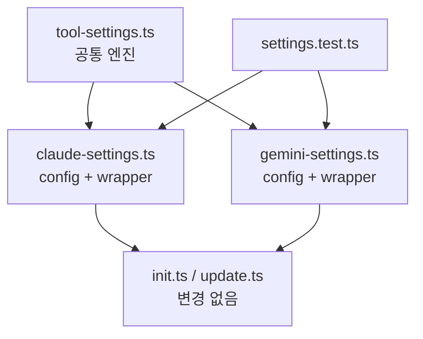

# 유지보수성 개선 리팩토링

## Context

코드베이스 전체를 탐색하여 시스템을 단순화할 수 있는 리팩토링 포인트를 식별했다.
코드 철학(Rule of Three, 불필요한 추상화 금지)에 따라 가치가 있는 항목만 선별.
init/update 설치 루프(2회)와 `deduplicateRules`(2회)는 현 상태 유지.

## 실행 순서

### Step 1. Dead code 삭제

`skill-state.ts:71~108`의 `buildProjectManifestForSkill`, `buildSkillRegistry` 삭제.
repo 내 import 없음 확인 완료. core public index에도 미노출.

**대상 파일:**

- `apps/cli/src/lib/skill-state.ts`

### Step 2. Settings 동작 테스트 추가

현재 `installClaudeSettings`/`uninstallClaudeSettings`/`installGeminiSettings`/`uninstallGeminiSettings`에 대한 직접 단위 테스트가 없다. 팩토리 추출 전에 회귀 감지 그물을 먼저 깔아둔다.

**신규 파일:** `apps/cli/src/__tests__/settings.test.ts`

테스트 케이스 (Claude/Gemini 각각):

1. `install` — 빈 디렉토리에 설치 → 파일 생성, 선택된 patch 반영
2. `install` — 기존 파일 있을 때 → deepMerge (기존 키 보존)
3. `install` — 빈 배열 → no-op (파일 미생성)
4. `uninstall` — 설치된 키 제거 → cleaned (파일에서 해당 키 제거, 나머지 보존)
5. `uninstall` — 전체 제거 → deleted (파일 삭제)
6. `uninstall` — 파일 없음 → notFound

패턴: `mkdtempSync`로 임시 디렉토리, 실제 파일 I/O. 기존 `install.test.ts` 패턴 따름.

### Step 3. Thin factory 추출

`tool-settings.ts`에 install/uninstall 알고리즘만 추출. 타입은 `Record<string, unknown>`으로 충분 — 도구별 타입 일반화 안 함.

**신규 파일:** `apps/cli/src/lib/tool-settings.ts`

```typescript
// tool-settings.ts — 공통 엔진

type SettingGroup = {
  value: string;
  label: string;
  hint: string;
  patch: Record<string, unknown>;
};

type ToolSettingsConfig = {
  dirName: string; // '.claude' | '.gemini'
  fileName: string; // 'settings.local.json' | 'settings.json'
  promptMessage: string; // confirm 메시지
  groups: readonly SettingGroup[];
};

// prompt, install, uninstall 각각 export
```

각 도구 파일은 wrapper로 남김:

```typescript
// claude-settings.ts
import { createToolSettingsPrompt, installToolSettings, uninstallToolSettings } from './tool-settings.js';

const CONFIG: ToolSettingsConfig = {
  dirName: '.claude',
  fileName: 'settings.local.json',
  promptMessage: 'Claude Code 설정 파일(.claude/settings.local.json)을 설치하시겠습니까?',
  groups: CLAUDE_SETTING_GROUPS,
};

export const promptClaudeSettings = createToolSettingsPrompt(CONFIG);
export const installClaudeSettings = (basePath: string, selected: readonly string[]) =>
  installToolSettings(basePath, selected, CONFIG);
export const uninstallClaudeSettings = (basePath: string, selected: readonly string[]) =>
  uninstallToolSettings(basePath, selected, CONFIG);
```

export 이름과 시그니처가 동일하므로 호출부 변경 없음.

**대상 파일:**

- `apps/cli/src/lib/tool-settings.ts` (신규)
- `apps/cli/src/lib/claude-settings.ts` (wrapper로 축소)
- `apps/cli/src/lib/gemini-settings.ts` (wrapper로 축소)

### Step 4. 검증

```bash
npm run build && npm test
```

Step 2에서 추가한 settings 테스트가 install/uninstall 동작을 직접 검증하므로 팩토리 추출 회귀를 감지할 수 있다.

## 영향 범위


