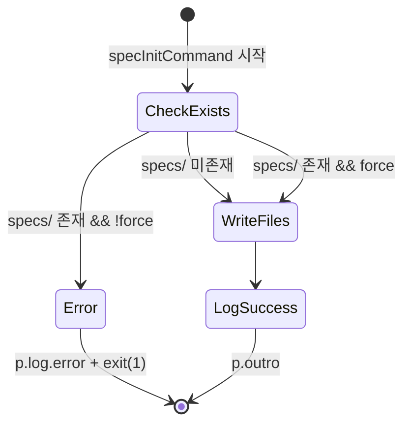

# `ai-ops spec init` 명령 구현 계획

## Context

신규 프로젝트에서 spec 파이프라인을 시작할 수 있도록 `specs/` 디렉토리 구조를 생성하는 `ai-ops spec init` 명령을 추가한다. 기존 `skill` parent command 패턴을 따라 `spec` parent 아래 `init` subcommand로 등록한다.

## 구현 흐름

## 파일 변경 목록

### 1. 신규: `apps/cli/src/data/spec-readme.ts`
- README 템플릿 상수(`SPEC_README_TEMPLATE`) export
- 요구사항에 명시된 전체 README 내용을 문자열 상수로 저장

### 2. 신규: `apps/cli/src/core/spec-plan.ts`
- `buildSpecInitPlan(): readonly FileAction[]` pure function
- `FileAction` 타입은 `install-plan.ts`에서 import 재사용
- 반환값: 3개 FileAction (`specs/README.md`, `specs/baseline/.gitkeep`, `specs/delta/.gitkeep`)

### 3. 수정: `apps/cli/src/core/index.ts`
- `export * from './spec-plan.js'` 추가

### 4. 신규: `apps/cli/src/commands/spec.ts`
- `specInitCommand(opts: { force: boolean }): Promise<void>` export
- 패턴: `p.intro` → exists 체크 → `buildSpecInitPlan()` → fs 쓰기 → `p.log.success` → `p.outro`
- `existsSync(specsDir) && !opts.force` → `p.log.error` + `process.exit(1)`
- `mkdirSync(dirname, { recursive: true })` + `writeFileSync` (덮어쓰기로 idempotent)

### 5. 수정: `apps/cli/src/bin/index.ts`
- `specInitCommand` import 추가
- `spec` parent command 등록 (`skill` 패턴과 동일)
- `spec init` subcommand에 `--force` 옵션 등록

### 6. 신규: `apps/cli/src/core/__tests__/spec-plan.test.ts`
- `buildSpecInitPlan`이 정확히 3개 FileAction 반환
- 각 relativePath 검증
- README content 비어있지 않음
- `.gitkeep` content가 빈 문자열

## 주요 참조 파일
- `apps/cli/src/bin/index.ts` — `skill` parent command 등록 패턴
- `apps/cli/src/core/install-plan.ts:14-17` — `FileAction` 타입
- `apps/cli/src/core/index.ts` — barrel export
- `apps/cli/src/commands/update.ts` — `--force` 옵션 + clack 패턴

## 검증 방법
1. `npm run build` — 컴파일 성공 확인
2. `npm test` — 기존 테스트 + 새 spec-plan 테스트 통과
3. `node dist/bin/index.js spec init` — `specs/` 생성 확인
4. 재실행 → `--force` 없이 에러 메시지 확인
5. `node dist/bin/index.js spec init --force` → 재생성 확인
6. `node dist/bin/index.js spec --help` → 도움말 출력 확인
