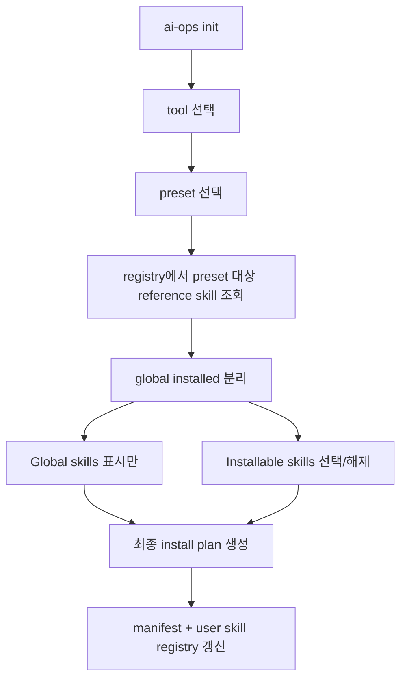

# Skill Catalog 재구성 및 `ai-ops init` 설치 UX 개편

## Summary

`apps/cli/data/skills/`를 `reference-skills`와 `task-skills`로 분리하고, 설치/분류 메타데이터는 `skill-registry.json` 계열의 별도 registry 파일로 통합 관리한다. `SKILL.md`는 에이전트가 실제 읽는 설명과 라우팅에 집중시키고, CLI는 registry를 SSOT로 사용해 로딩, 검증, 설치 가능 범위, 그룹핑, `init` 표시 정책을 결정한다.

`ai-ops init`은 preset-first 흐름을 유지하되, 선택한 preset에 매핑된 `reference` skill만 노출한다. 화면은 `이미 전역 설치된 skill`과 `이번에 설치 가능한 skill`을 분리해서 보여주고, 사용자는 설치 가능한 skill만 선택 해제할 수 있다. `task` skill은 `init`에서 제외하고 `ai-ops skill install/uninstall`로만 관리한다.

## Key Changes

### 1. Skill source layout 및 metadata SSOT 변경

- 소스 디렉토리를 아래처럼 재구성한다.
  - `apps/cli/data/skills/reference-skills/<skill-id>/`
  - `apps/cli/data/skills/task-skills/<skill-id>/`
- 신규 registry 파일을 추가한다.
  - 권장: `apps/cli/data/skills/skill-registry.json`
- registry 항목은 최소 아래 필드를 가진다.
  - `id`
  - `kind`
  - `description`
  - `supported_tools`
  - `install_scopes`
  - `groups`
  - `included_in_presets`
  - `source_path`
- `SKILL.md` frontmatter에서는 CLI 전용 메타데이터를 제거한다.
  - 유지: `name`, 에이전트가 실제 필요로 하는 추가 frontmatter
  - 제거: `kind`, `supported_tools`, `install_scopes`
- loader는 디렉토리 스캔 중심에서 `registry -> source_path 해석 -> 파일 로드` 순서로 변경한다.
- validation은 2단계로 나눈다.
  - registry schema validation
  - 각 skill 디렉토리 shape validation
- `reference` skill의 `references/reference.md` 필수 조건은 유지한다.
- `task` skill의 절차 본문은 계속 `SKILL.md`에 둔다.

### 2. Core schema / loader / state model 조정

- `SkillFrontmatterSchema`는 agent-facing 최소 필드만 검증하도록 축소한다.
- `Skill` 타입의 `kind`, `supported_tools`, `install_scopes`, `description`은 registry에서 채운다.
- `loadAllSkills`는 registry 기반으로 읽고, `source_path`를 통해 실제 디렉토리를 해석한다.
- 기존 `resolveCanonicalSkillId`, manifest, skill registry 저장 포맷은 최대한 유지한다.
- `InstalledSkill`은 현재 필드를 유지한다.
  - `kind`, `tools`, `scope`, `installed_paths`, `sourceHash`
- `computeSourceHash`에 registry 파일이 포함되도록 해, 메타데이터 변경도 diff/update 대상이 되게 한다.
- `apps/cli/data/skills/README.md`와 `apps/cli/README.md`를 새 구조와 authoring 규칙에 맞게 업데이트한다.

### 3. `ai-ops init` UX 변경

- preset 선택 후 전체 skill을 보여주지 않고, 해당 preset의 `reference` skill만 후보로 노출한다.
- 후보는 두 섹션으로 나눈다.
  - `Already available globally`
  - `Install now`
- `Already available globally` 섹션은 정보성 표시만 하고 선택 입력은 받지 않는다.
- `Install now` 섹션만 multiselect 대상으로 삼는다.
- 전역 설치되어 이미 사용 가능한 skill은 기본적으로 재설치하지 않는다.
- `init`에서 scope를 `user`로 고른 경우에도, 이미 동일 skill이 전역에 설치되어 있으면 설치 대상에서 제외한다.
- `project` scope를 고른 경우에도 전역 설치 상태는 별도 안내하되, 이번 설계에서는 project override 선택지는 두지 않는다.
- 주사용 단위 그룹핑은 현재 `presets.yaml`을 계속 사용한다.
  - `frontend-web`, `frontend-app`, `backend-ts`, `backend-python`
- 필요하면 표시 라벨만 바꾸고 내부 preset id는 유지 가능하다.
- `task` skill은 `init` 후보 계산에서 완전히 제외한다.

### 4. `ai-ops skill` 명령 동작 정리

- `ai-ops skill list`는 `reference`와 `task`를 구분 표시하고, kind별로 그룹핑해 출력한다.
- `ai-ops skill install/uninstall/diff`는 두 종류 모두 지원하되, registry를 기준으로 lookup한다.
- `task` skill은 여기서만 설치/삭제 가능하다는 정책을 help text와 README에 반영한다.

## Public Interfaces / Data Changes

- 신규 data file:
  - `apps/cli/data/skills/skill-registry.json`
- 변경되는 내부 스키마:
  - `SkillFrontmatterSchema`
  - `Skill` type
  - registry schema 신규 추가
- 변경되는 CLI 동작:
  - `ai-ops init` skill selection visibility
  - `ai-ops skill list` 출력 형식
- 유지되는 외부 저장 포맷:
  - project manifest
  - user `skills-manifest.json`
- 호환성 기본값:
  - 기존 설치본은 uninstall/update 대상 식별을 위해 기존 manifest/registry를 그대로 읽는다.
  - source layout migration은 컴파일러 입력만 바꾸고, 설치 경로 `.agents/skills/<id>`, `.claude/skills/<id>`는 유지한다.

## Test Plan

- loader
  - registry의 `source_path`가 잘못되면 실패
  - `reference` skill에 `references/reference.md`가 없으면 실패
  - registry `id`와 `SKILL.md`의 `name`이 다르면 실패
- schema
  - registry item 필수 필드 누락 시 실패
  - `task`/`reference`별 허용 shape 검증
- init flow
  - preset 선택 시 관련 `reference` skill만 노출
  - `task` skill은 노출되지 않음
  - 전역 설치된 skill은 `Already available globally`로만 표시
  - 설치 가능한 skill만 multiselect 가능
  - 최종 설치 계획에서 전역 설치된 skill이 중복 설치되지 않음
- skill commands
  - `skill list`가 kind별로 표시
  - `skill install`이 `task` skill도 정상 설치
  - `skill diff`가 registry 변경으로 source hash 차이를 감지
- e2e
  - 전역에 선설치된 `reference` skill이 있는 상태에서 `ai-ops init` 실행
  - project scope와 user scope 각각에서 기대 manifest/registry 결과 확인

## Assumptions

- `init`은 `reference` knowledge pack 설치용 진입점으로 한정하고, `task` workflow skill은 여기서 다루지 않는다.
- skill의 사용 단위 그룹핑은 별도 새 개념을 만들기보다 preset 매핑과 registry `groups`로 관리한다.
- 전역 설치된 skill은 재사용 가능으로 간주하며, 이번 변경에서는 project override UX를 넣지 않는다.
- `SKILL.md`는 agent consumption 문서이므로, CLI 설치 정책 메타데이터는 registry로 이동하는 것이 우선이다.
- 기존 preset-first 구조는 유지하고, 문제였던 전체 skill 노출만 제거한다.
