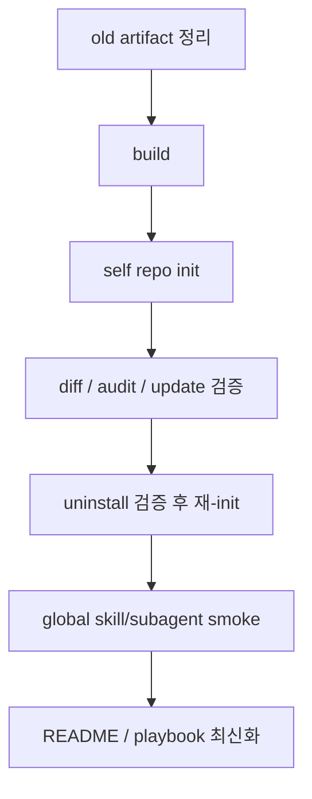

# Phase 6 구현 계획: 통합 검증과 Self Dogfood

## Summary

Phase 6는 새 CLI 기능을 추가하기보다, Phase 1-5 결과물을 실제 repo에 적용해서 old model 산출물과 new operating layer가 섞이지 않는지 검증하는 단계다. 이번 구현 범위는 **이 repo self-dogfood + 외부 대표 프로젝트 적용 체크리스트 문서화**로 고정한다.

## Implementation Changes

- self-dogfood를 실제 repo에 적용한다.
  - 기존 old artifact인 root `AGENTS.md`, `GEMINI.md`, `.claude/CLAUDE.md`를 새 모델 기준으로 정리한다.
  - `node apps/cli/dist/bin/index.js init --tool codex --tool gemini --tool claude-code`로 새 operating layer를 설치한다.
  - 최종 repo 상태는 root `AGENTS.md`, `GEMINI.md`, `CLAUDE.md`, `docs/agent/*`, `docs/business/*`, `docs/docs-status.md`, `.ai-ops/manifest.json`, `.ai-ops/context-layer.json`를 가진다.
  - legacy `.claude/CLAUDE.md`는 제거하고, Claude adapter는 root `CLAUDE.md`만 남긴다.

- optional pack은 이 repo에 설치하지 않는다.
  - 이 repo는 현재 `.codex/plans/*` 중심으로 phase plan을 관리하므로 `docs/specs/`는 필요 프로젝트용 optional pack으로만 남긴다.
  - Phase 6 검증은 `pack list`와 외부 적용 체크리스트로 다루고, self repo에는 `spec-lifecycle` pack을 설치하지 않는다.

- global asset 경계를 smoke test로 확인한다.
  - temp `AI_OPS_HOME`에서 `doc-impact-reviewer`, `security-gate`, `security-reviewer` 설치를 실행한다.
  - repo에는 `.agents/skills`, `.codex/agents`, `.claude/agents`, `.gemini/agents`, `.ai-ops/skills-manifest.json`, `.ai-ops/subagents-manifest.json`가 생기지 않아야 한다.
  - `.codex/plans`는 기존 repo 운영 파일이므로 global asset 침범 여부 판단 대상에서 제외한다.

- 문서를 현재 상태로 업데이트한다.
  - README 계열의 “planned/current transition” 표현을 실제 구현 완료 모델에 맞게 정리한다.
  - `docs/implementation-playbook.md` Phase 6에 self-dogfood 명령, uninstall/re-init 검증, 외부 대표 프로젝트 적용 체크리스트를 추가한다.
  - 외부 대표 프로젝트는 이번 커밋에서 직접 수정하지 않고, 체크리스트 기준으로 후속 실행한다.

- dogfood 중 버그가 발견되면 좁게 수정한다.
  - 새 명령 표면은 추가하지 않는다.
  - 수정이 필요하면 dogfood 실패를 재현하는 테스트를 함께 추가한다.

## Public Interface

- 새 CLI 명령이나 옵션은 추가하지 않는다.
- 검증 대상 public surface는 기존 계약 그대로다.
  - project: `init`, `diff`, `audit`, `update`, `uninstall`, `pack`
  - global: `skill`, `subagent`
- root `CLAUDE.md`가 공식 Claude adapter가 되고, `.claude/CLAUDE.md`는 이 repo에서 제거된다.

## Test Plan

- 기본 검증
  - `npm run build`
  - `npm run check`
  - `npm run compile`

- self-dogfood lifecycle
  - `node apps/cli/dist/bin/index.js init --tool codex --tool gemini --tool claude-code`
  - `node apps/cli/dist/bin/index.js diff`
  - `node apps/cli/dist/bin/index.js audit`
  - `node apps/cli/dist/bin/index.js update --force`
  - `node apps/cli/dist/bin/index.js diff`
  - `node apps/cli/dist/bin/index.js uninstall --yes`
  - `node apps/cli/dist/bin/index.js init --tool codex --tool gemini --tool claude-code`
  - `node apps/cli/dist/bin/index.js audit`

- pack/global smoke
  - `node apps/cli/dist/bin/index.js pack list`
  - temp `AI_OPS_HOME`에서 `skill install doc-impact-reviewer --tool codex`
  - temp `AI_OPS_HOME`에서 `subagent install security-reviewer --tool codex --tool claude-code --tool gemini`
  - repo-local global asset 경로가 생성되지 않았는지 확인한다.

## Assumptions

- 대표 프로젝트 1개 실제 적용은 이번 커밋에 포함하지 않고 체크리스트로 남긴다.
- self repo에는 `spec-lifecycle` pack을 설치하지 않는다.
- old model 내용은 자동 마이그레이션하지 않는다. 필요한 프로젝트별 운영 지식은 새 layer 설치 후 운영자가 project-owned 문서에 명시적으로 채운다.
