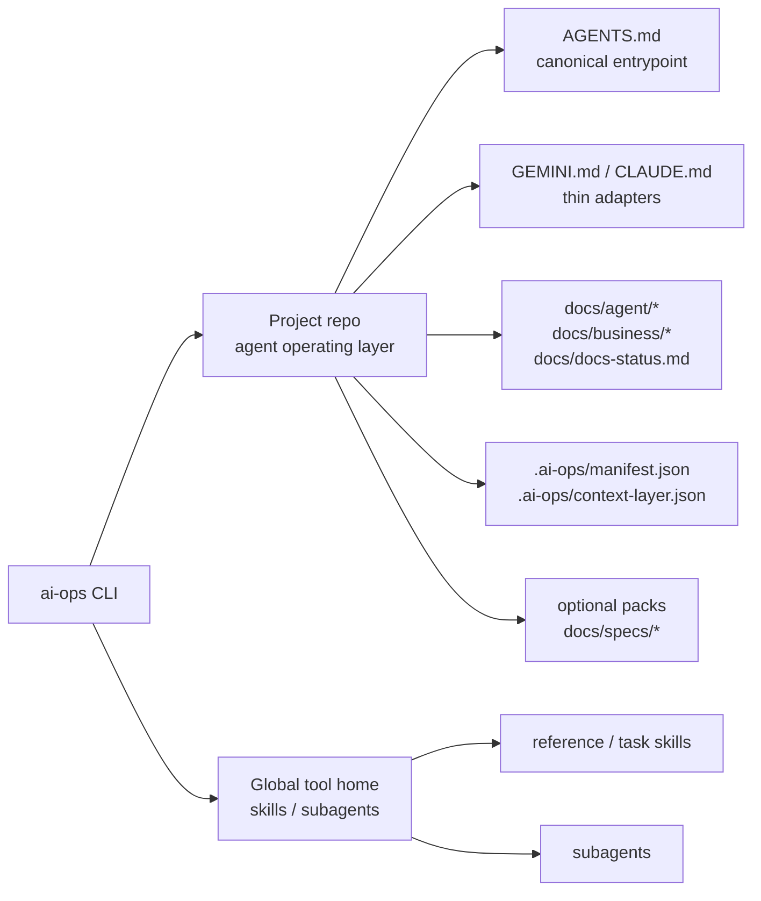

# ai-ops-cli

[English](./README.md)

`ai-ops-cli`의 다음 major breaking model을 설계하고 구현한 모노레포입니다. 새 제품 정의는 “프로젝트에는 AI agent operating layer를 설치하고, 사용자 환경에는 agent skills/subagents를 설치한다”입니다.

현재 repo 구현은 이 operating layer 모델을 기준으로 동작합니다. old rules + skills scaffolder 모델은 deprecated 문맥으로만 남깁니다.

## 목표 모델



## 저장소 구조

```text
.
├── apps/
│   └── cli/
│       ├── src/
│       │   ├── bin/        # CLI entrypoint
│       │   ├── commands/   # init/diff/audit/update/uninstall/skill/subagent/pack
│       │   ├── core/       # schemas, loader, renderer, registry, project layer
│       │   └── lib/        # global asset and legacy helper utilities
│       ├── data/
│       │   ├── context-layer/ # project operating layer templates
│       │   ├── skills/        # global skill source/catalog data
│       │   ├── packs/         # optional project pack source data
│       │   └── subagents/     # global subagent source/catalog data
│       └── README.md          # package-level operating layer contract
├── docs/
│   ├── plan.md                     # master blueprint
│   ├── implementation-playbook.md  # phase execution guide
│   └── references/                 # collected tool references
└── scripts/
    └── publish.sh                  # CLI release script
```

## Project Operating Layer

새 모델에서 project repo에 설치되는 대상은 다음 운영 문서와 상태 파일입니다.

- `AGENTS.md`
- `GEMINI.md`
- `CLAUDE.md`
- `docs/agent/rules/00-agent-baseline.md`
- `docs/agent/workflow.md`
- `docs/agent/rules/*`
- `docs/agent/checks/*`
- `docs/agent/maps/codebase-map.md`
- `docs/business/business-rules.md`
- `docs/docs-status.md`
- `.ai-ops/manifest.json`
- `.ai-ops/context-layer.json`

`AGENTS.md`가 canonical entrypoint입니다. `docs/agent/rules/00-agent-baseline.md`는 협업 태도, 커뮤니케이션, 코드 철학, naming, planning 기본값을 담고 `AGENTS.md` 직후 먼저 읽습니다. `GEMINI.md`와 `CLAUDE.md`는 tool adapter로만 두고 운영 규칙을 중복하지 않습니다.

## 수정 FAQ

### `ai-ops update`가 덮어쓰는 파일은 무엇인가요?

`AGENTS.md`, `GEMINI.md`, `CLAUDE.md`, `docs/agent/rules/*`, `docs/agent/checks/*`, `docs/agent/workflow.md`는 ai-ops managed 문서입니다. 이 파일의 `<!-- ai-ops:start -->`부터 `<!-- ai-ops:end -->`까지는 CLI 템플릿 영역이고, `ai-ops update` 때 현재 CLI 템플릿으로 다시 적용됩니다. 사용자가 이 영역을 직접 수정하면 다음 update에서 유지되지 않습니다.

`.ai-ops/manifest.json`과 `.ai-ops/context-layer.json`도 직접 편집 대상이 아닙니다. 각각 설치 상태와 문서 index를 기록하는 CLI 상태 파일입니다.

### 사용자가 직접 수정해야 하는 파일은 무엇인가요?

프로젝트 지식은 project-owned 문서에 적습니다. 기본 project-owned 문서는 `docs/agent/maps/codebase-map.md`, `docs/business/business-rules.md`, `docs/docs-status.md`입니다. `docs/agent/maps/codebase-map.md`와 `docs/business/business-rules.md`는 처음에는 Reserved 템플릿이지만, 프로젝트가 실제 내용을 채운 뒤에는 update가 자동으로 덮어쓰지 않습니다.

`docs/docs-status.md`는 project-owned 문서이지만 자유 메모장이 아니라 context-layer registry입니다. 문서 status/frontmatter를 바꿀 때 함께 맞추는 파일이며, update 과정에서 manifest와 실제 문서 frontmatter 기준으로 테이블이 정리될 수 있습니다.

### 프로젝트 고유 agent rule은 어디에 적나요?

현재 기본 layer에는 프로젝트 구조와 비즈니스 규칙을 담는 project-owned 문서가 있지만, 프로젝트별 agent 행동 규칙만을 위한 별도 Active 문서는 아직 first-class 템플릿으로 열려 있지 않습니다. 그래서 `AGENTS.md`의 managed 영역이나 tool adapter에 직접 규칙을 추가하는 방식은 update-safe한 계약이 아닙니다.

프로젝트별 agent rule을 안정적으로 지원하려면 `docs/agent/rules/project-rules.md` 같은 project-owned Active 문서를 추가하고, manifest/context-layer/docs-status가 함께 추적하도록 제품 계약을 확장하는 것이 다음 개선 후보입니다.

## Global Assets

skills와 subagents는 프로젝트에 복사하지 않습니다. 각 도구의 user/global discovery 규칙에 맞춰 설치하고, project manifest에는 기록하지 않습니다.

global asset 명령은 `AI_OPS_HOME` 또는 `HOME`이 있어야 실행됩니다. 둘 다 없으면 cwd fallback 없이 실패합니다.

유지하는 global asset 종류:

- reference skills
- task skills
- subagents

현재 skill lifecycle은 global registry만 사용합니다.

```bash
ai-ops skill list
ai-ops skill install skill-load-check --tool codex
ai-ops skill install doc-impact-reviewer --tool codex
ai-ops skill diff
ai-ops skill update
ai-ops skill uninstall skill-load-check
```

`doc-impact-reviewer`는 변경 완료 또는 커밋 직전에 diff를 보고 갱신해야 할 운영 문서 후보를 판정하는 task skill입니다. 수동으로 `$doc-impact-reviewer`를 호출해 사용하며, 사용자 확인 전에는 문서를 수정하지 않고 직접 staging/commit도 하지 않습니다.

Subagent lifecycle도 global registry만 사용합니다.

```bash
ai-ops subagent list
ai-ops subagent install security-gate --tool codex
ai-ops subagent diff
ai-ops subagent update
ai-ops subagent uninstall security-gate
```

설치 위치는 도구별 global discovery 경로입니다.

- Codex: `.codex/agents/<id>.toml`
- Claude Code: `.claude/agents/<id>.md`
- Gemini CLI: `.gemini/agents/<id>.md`
- 상태 파일: `.ai-ops/subagents-manifest.json`

## Optional Specs Pack

`docs/specs/`는 optional pack 위치로 고정합니다. spec lifecycle이 필요한 프로젝트만 설치합니다.

```bash
ai-ops init --tool codex
ai-ops pack list
ai-ops pack install spec-lifecycle
ai-ops pack diff spec-lifecycle
ai-ops pack update spec-lifecycle
ai-ops pack uninstall spec-lifecycle
```

`spec-lifecycle` pack은 `.ai-ops/manifest.json`이 있는 project operating layer 안에서만 동작합니다. 설치 시 `docs/specs/README.md`와 `docs/specs/README.ko.md`는 `Reserved` 문서로 context-layer와 `docs/docs-status.md`에 기록하고, `.gitkeep` 파일은 일반 pack file로만 manifest에 기록합니다.

Deprecated old model:

- root `specs/`는 새 모델의 설치 위치가 아닙니다.
- old `ai-ops spec init` 방식은 optional pack 설치 모델로 대체되었습니다.

## Deprecated Old Model

다음 항목은 현재 코드나 과거 문서에 남아 있을 수 있지만 새 계약에서는 제거 대상입니다.

- preset-first init UX
- project scope skill 설치
- `ai-ops skill install --project`
- `.ai-ops-manifest.json`
- legacy manifest migration
- root `specs/`

이번 전환은 breaking release입니다. 기존 프로젝트는 old CLI로 uninstall한 뒤 새 major CLI로 다시 init합니다.

## Development

저장소 루트 기준:

```bash
npm install
npm run build
npm test
```

자주 쓰는 명령:

```bash
# Build and print CLI help from dist
npm run compile

# Workspace watch mode
npm run dev

# Lint + test
npm run check
```

코드와 운영 문서 변경은 `npm run check`를 기본 검증으로 사용합니다. CLI 배포 산출물 확인은 `npm run build`와 `npm run compile`을 함께 사용합니다.

Self-dogfood 검증은 이 repo에서 root `AGENTS.md`, `GEMINI.md`, `CLAUDE.md`, `docs/agent/*`, `docs/business/*`, `docs/docs-status.md`, `.ai-ops/manifest.json`, `.ai-ops/context-layer.json`를 실제 설치한 뒤 수행합니다. legacy `.claude/CLAUDE.md`와 `.claude/rules/*`는 공식 operating layer가 아니며, Claude Code adapter는 root `CLAUDE.md`만 사용합니다.

## Docs

- [Master blueprint](./docs/plan.md)
- [Implementation playbook](./docs/implementation-playbook.md)

## Release

Release scripts:

```bash
npm run publish:patch
npm run publish:minor
npm run publish:major
```

## License

MIT
