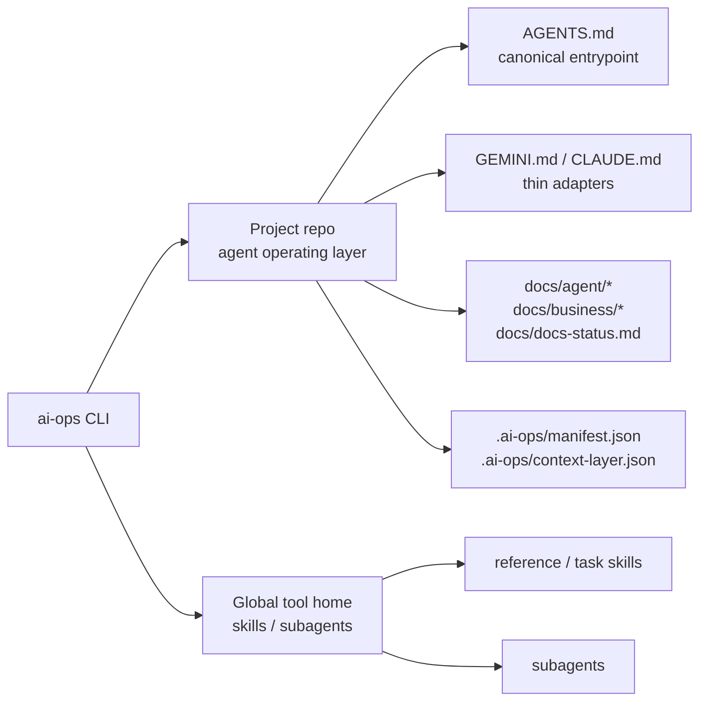

# ai-ops-scaffolder

`ai-ops`의 다음 major breaking model을 설계하고 구현하는 모노레포입니다. 새 제품 정의는 “프로젝트에는 AI agent operating layer를 설치하고, 사용자 환경에는 agent skills/subagents를 설치한다”입니다.

현재 코드는 old rules + skills scaffolder 모델에서 새 모델로 전환 중입니다. 이 README는 Phase 0에서 고정한 목표 계약을 설명하며, 실제 CLI 동작은 후속 phase 구현 전까지 일부 old model과 다를 수 있습니다.

## 목표 모델



## Repository Layout

```text
.
├── apps/
│   └── cli/
│       ├── src/
│       │   ├── bin/        # CLI entrypoint
│       │   ├── commands/   # init/skill/update/diff/uninstall
│       │   ├── core/       # schemas, loader, renderer, registry
│       │   └── lib/        # install/uninstall/settings helpers
│       ├── data/
│       │   ├── rules/      # old model core rule data
│       │   ├── skills/     # global skill source/catalog data
│       │   ├── subagents/  # global subagent source/catalog 데이터
│       │   └── presets.yaml
│       └── README.md       # package-level transition contract
├── docs/
│   ├── plan.md                     # master blueprint
│   ├── implementation-playbook.md  # phase execution guide
│   └── references/                 # collected tool references
└── scripts/
    └── publish.sh                  # CLI release script
```

## Project Operating Layer

새 모델에서 project repo에 설치되는 대상은 다음 운영 문서와 상태 파일입니다.

- `AGENTS.md`
- `GEMINI.md`
- `CLAUDE.md`
- `docs/agent/workflow.md`
- `docs/agent/rules/*`
- `docs/agent/checks/*`
- `docs/agent/maps/codebase-map.md`
- `docs/business/business-rules.md`
- `docs/docs-status.md`
- `.ai-ops/manifest.json`
- `.ai-ops/context-layer.json`

`AGENTS.md`가 canonical entrypoint입니다. `GEMINI.md`와 `CLAUDE.md`는 tool adapter로만 두고 운영 규칙을 중복하지 않습니다.

## Global Assets

skills와 subagents는 프로젝트에 복사하지 않습니다. 각 도구의 user/global discovery 규칙에 맞춰 설치하고, project manifest에는 기록하지 않습니다.
global asset 명령은 `AI_OPS_HOME` 또는 `HOME`이 있어야 실행됩니다. 둘 다 없으면 cwd fallback 없이 실패합니다.

유지하는 global asset 종류:

- reference skills
- task skills
- subagents

현재 skill lifecycle은 global registry만 사용합니다.

```bash
ai-ops skill list
ai-ops skill install skill-load-check --tool codex
ai-ops skill diff
ai-ops skill update
ai-ops skill uninstall skill-load-check
```

Subagent lifecycle도 global registry만 사용합니다.

```bash
ai-ops subagent list
ai-ops subagent install security-gate --tool codex
ai-ops subagent diff
ai-ops subagent update
ai-ops subagent uninstall security-gate
```

설치 위치는 도구별 global discovery 경로입니다.

- Codex: `.codex/agents/<id>.toml`
- Claude Code: `.claude/agents/<id>.md`
- Gemini CLI: `.gemini/agents/<id>.md`
- 상태 파일: `.ai-ops/subagents-manifest.json`

## Optional Specs Pack

`docs/specs/`는 optional pack 위치로 고정합니다. spec lifecycle이 필요한 프로젝트만 설치합니다.

Deprecated old model:

- root `specs/`는 새 모델의 설치 위치가 아닙니다.
- old `ai-ops spec init` 방식은 후속 phase에서 optional pack 설치 모델로 대체합니다.

## Deprecated Old Model

다음 항목은 현재 코드나 과거 문서에 남아 있을 수 있지만 새 계약에서는 제거 대상입니다.

- preset-first init UX
- project scope skill 설치
- `ai-ops skill install --project`
- `.ai-ops-manifest.json`
- legacy manifest migration
- root `specs/`

이번 전환은 breaking release입니다. 기존 프로젝트는 old CLI로 uninstall한 뒤 새 major CLI로 다시 init합니다.

## Development

저장소 루트 기준:

```bash
npm install
npm run build
npm test
```

자주 쓰는 명령:

```bash
# Build and print CLI help from dist
npm run compile

# Workspace watch mode
npm run dev

# Lint + test
npm run check
```

Phase 0은 문서 계약 고정 단계라 코드 검증은 필수 완료 기준이 아닙니다. 코드 phase에서는 `npm run check`를 기본 검증으로 사용합니다.

## Docs

- [Master blueprint](./docs/plan.md)
- [Implementation playbook](./docs/implementation-playbook.md)
- [Rule authoring guide](./docs/rule-authoring-guide.md)

## Release

Release scripts:

```bash
npm run publish:patch
npm run publish:minor
npm run publish:major
```

## License

MIT
