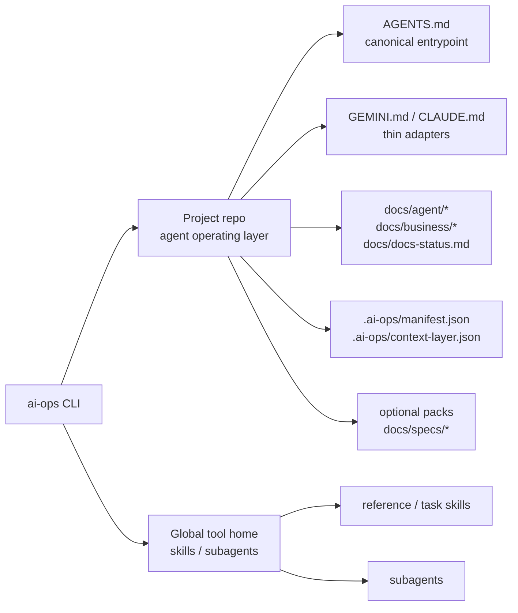

# ai-ops-cli

[Korean](./README.ko.md)

`ai-ops-cli` is the monorepo for designing and implementing the next major breaking model of `ai-ops-cli`. The new product definition is: install an AI agent operating layer into a project, and install reusable agent skills/subagents into the user's global tool environment.

The current implementation follows this operating-layer model. The old rules + skills scaffolder model remains only as deprecated context.

## Target Model



## Repository Layout

```text
.
├── apps/
│   └── cli/
│       ├── src/
│       │   ├── bin/        # CLI entrypoint
│       │   ├── commands/   # init/diff/audit/update/uninstall/skill/subagent/pack
│       │   ├── core/       # schemas, loader, renderer, registry, project layer
│       │   └── lib/        # global asset and legacy helper utilities
│       ├── data/
│       │   ├── context-layer/ # project operating layer templates
│       │   ├── skills/        # global skill source/catalog data
│       │   ├── packs/         # optional project pack source data
│       │   └── subagents/     # global subagent source/catalog data
│       └── README.md          # package-level operating layer contract
├── docs/
│   ├── plan.md                     # master blueprint
│   ├── implementation-playbook.md  # phase execution guide
│   └── references/                 # collected tool references
└── scripts/
    └── publish.sh                  # CLI release script
```

## Project Operating Layer

In the new model, the project repo receives these operating documents and state files:

- `AGENTS.md`
- `GEMINI.md`
- `CLAUDE.md`
- `docs/agent/rules/00-agent-baseline.md`
- `docs/agent/workflow.md`
- `docs/agent/rules/*`
- `docs/agent/checks/*`
- `docs/agent/maps/codebase-map.md`
- `docs/business/business-rules.md`
- `docs/docs-status.md`
- `.ai-ops/manifest.json`
- `.ai-ops/context-layer.json`

`AGENTS.md` is the canonical entrypoint. `docs/agent/rules/00-agent-baseline.md` is read immediately after `AGENTS.md` and contains the default collaboration posture, communication rules, code philosophy, naming rules, and planning defaults. `GEMINI.md` and `CLAUDE.md` are thin tool adapters and should not duplicate canonical operating rules.

## Editing FAQ

### What does `ai-ops update` overwrite?

`AGENTS.md`, `GEMINI.md`, `CLAUDE.md`, `docs/agent/rules/*`, `docs/agent/checks/*`, and `docs/agent/workflow.md` are ai-ops managed documents. In these files, the region from `<!-- ai-ops:start -->` through `<!-- ai-ops:end -->` is CLI template content. `ai-ops update` reapplies the current CLI template to that region. User edits inside that region are not preserved across update.

`.ai-ops/manifest.json` and `.ai-ops/context-layer.json` are also not direct-edit files. They are CLI state files for installation state and document indexing.

### Which files should users edit directly?

Project knowledge belongs in project-owned documents. The default project-owned documents are `docs/agent/maps/codebase-map.md`, `docs/business/business-rules.md`, and `docs/docs-status.md`. `docs/agent/maps/codebase-map.md` and `docs/business/business-rules.md` start as Reserved templates, but once the project fills them with real content, update does not automatically overwrite them.

`docs/docs-status.md` is project-owned, but it is not a free-form notebook. It is the context-layer registry. Update it together with document status/frontmatter changes; the update flow may also normalize its table from the manifest and current document frontmatter.

### Where should project-specific agent rules go?

The default layer currently has project-owned documents for project structure and business rules, but it does not yet provide a first-class Active template for project-specific agent behavior rules. Because of that, adding rules inside the managed region of `AGENTS.md` or inside a tool adapter is not an update-safe contract.

To support project-specific agent rules safely, the next product extension should add a project-owned Active document such as `docs/agent/rules/project-rules.md` and have the manifest, context-layer index, and docs-status table track it together.

## Global Assets

Skills and subagents are not copied into the project repo. The CLI installs them into each tool's user/global discovery path and does not record them in the project manifest.

Global asset commands require `AI_OPS_HOME` or `HOME`. If neither exists, they fail closed instead of falling back to the current working directory.

Maintained global asset types:

- reference skills
- task skills
- subagents

The current skill lifecycle uses only the global registry.

```bash
ai-ops skill list
ai-ops skill install skill-load-check --tool codex
ai-ops skill install doc-impact-reviewer --tool codex
ai-ops skill diff
ai-ops skill update
ai-ops skill uninstall skill-load-check
```

`doc-impact-reviewer` is a task skill that reviews diffs near the end of work or before commit and classifies operating-document update candidates. It is invoked manually with `$doc-impact-reviewer`; it does not edit documents, stage files, or commit before user approval.

The subagent lifecycle also uses only the global registry.

```bash
ai-ops subagent list
ai-ops subagent install security-gate --tool codex
ai-ops subagent diff
ai-ops subagent update
ai-ops subagent uninstall security-gate
```

Tool-specific install paths:

- Codex: `.codex/agents/<id>.toml`
- Claude Code: `.claude/agents/<id>.md`
- Gemini CLI: `.gemini/agents/<id>.md`
- State file: `.ai-ops/subagents-manifest.json`

## Optional Specs Pack

`docs/specs/` is the fixed optional pack location. Install it only for projects that need the spec lifecycle.

```bash
ai-ops init --tool codex
ai-ops pack list
ai-ops pack install spec-lifecycle
ai-ops pack diff spec-lifecycle
ai-ops pack update spec-lifecycle
ai-ops pack uninstall spec-lifecycle
```

The `spec-lifecycle` pack runs only inside a project operating layer with `.ai-ops/manifest.json`. On install, `docs/specs/README.md` and `docs/specs/README.ko.md` are registered as Reserved documents in the context-layer and `docs/docs-status.md`; `.gitkeep` files are tracked only as regular pack files in the manifest.

Deprecated old model:

- root `specs/` is no longer the install location.
- old `ai-ops spec init` is replaced by the optional pack install model.

## Deprecated Old Model

The following items may still appear in current code or older docs, but they are outside the new contract:

- preset-first init UX
- project-scope skill installation
- `ai-ops skill install --project`
- `.ai-ops-manifest.json`
- legacy manifest migration
- root `specs/`

This transition is a breaking release. Existing projects should run uninstall with the old CLI, install the new major CLI, and run init again with the new model.

## Development

From the repository root:

```bash
npm install
npm run build
npm test
```

Common commands:

```bash
# Build and print CLI help from dist
npm run compile

# Workspace watch mode
npm run dev

# Lint + test
npm run check
```

Use `npm run check` as the default validation for code and operating-document changes. For CLI release artifacts, run both `npm run build` and `npm run compile`.

Self-dogfood validation installs the root `AGENTS.md`, `GEMINI.md`, `CLAUDE.md`, `docs/agent/*`, `docs/business/*`, `docs/docs-status.md`, `.ai-ops/manifest.json`, and `.ai-ops/context-layer.json` in this repo. Legacy `.claude/CLAUDE.md` and `.claude/rules/*` are not part of the official operating layer; the Claude Code adapter is the root `CLAUDE.md`.

## Docs

- [Master blueprint](./docs/plan.md)
- [Implementation playbook](./docs/implementation-playbook.md)

## Release

Release scripts:

```bash
npm run publish:patch
npm run publish:minor
npm run publish:major
```

## License

MIT
