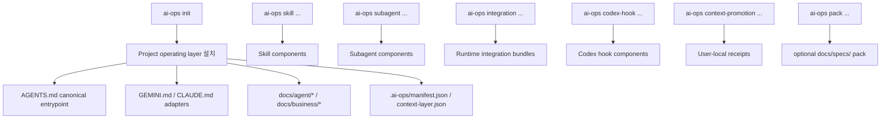

# ai-ops-cli

[English](./README.md)

`ai-ops-cli`는 프로젝트/에이전트 작업에 필요한 operating layer와 global runtime integration을 설치하고 관리하는 CLI입니다.

이 문서는 현재 구현된 breaking model을 설명합니다. 현재 CLI는 bundled user/global runtime workflow를 위한 `integration` 명령을 제공하고, skill, subagent, Codex hook, user-local receipt를 다루는 low-level component 명령도 계속 제공합니다. old rules + skills scaffolder 모델은 deprecated 문맥으로만 남깁니다.

## Current Breaking Model



핵심 경계:

- project scope는 operating layer 문서만 관리합니다.
- integration scope는 user/global runtime workflow만 관리합니다.
- skill, subagent, Codex hook, user-local receipt/config는 integration component입니다.
- `AGENTS.md`가 canonical entrypoint입니다.
- `GEMINI.md`와 `CLAUDE.md`는 `AGENTS.md`를 기준으로 삼게 하는 adapter입니다.
- `docs/specs/`는 optional pack 위치입니다.
- integration component 명령은 `AI_OPS_HOME` 또는 `HOME`이 없으면 cwd fallback 없이 실패합니다.

## 설치 대상

Project repo:

```text
AGENTS.md
GEMINI.md
CLAUDE.md
docs/agent/rules/00-agent-baseline.md
docs/agent/workflow.md
docs/agent/terminology.md
docs/agent/rules/routing-rules.md
docs/agent/rules/doc-update-rules.md
docs/agent/rules/stop-rules.md
docs/agent/checks/impact-checklist.md
docs/agent/maps/codebase-map.md
docs/business/terminology.md
docs/business/business-rules.md
docs/docs-status.md
.ai-ops/manifest.json
.ai-ops/context-layer.json
```

`docs/agent/rules/00-agent-baseline.md`는 기존 `role-persona`, `communication`, `code-philosophy`, `naming-convention`, `plan-mode`의 기본 의도를 새 operating layer 문서로 이관한 Active 규칙입니다. `AGENTS.md` 직후 먼저 읽습니다.

User/global runtime component home:

```text
skills/*
subagents/*
hooks/*
receipts/config/*
```

## 수정 FAQ

### `ai-ops update`가 덮어쓰는 파일은 무엇인가요?

`AGENTS.md`, `GEMINI.md`, `CLAUDE.md`, `docs/agent/rules/*`, `docs/agent/checks/impact-checklist.md`, `docs/agent/workflow.md`는 ai-ops managed 문서입니다. 이 파일의 `<!-- ai-ops:start -->`부터 `<!-- ai-ops:end -->`까지는 CLI 템플릿 영역이고, `ai-ops update` 때 현재 CLI 템플릿으로 다시 적용됩니다. 사용자가 이 영역을 직접 수정하면 다음 update에서 유지되지 않습니다.

`docs/agent/project-rules/*.md`는 project-owned 영역이며 `ai-ops update --force`가 내용을 덮어쓰지 않습니다.

`.ai-ops/manifest.json`과 `.ai-ops/context-layer.json`도 직접 편집 대상이 아닙니다. 각각 설치 상태와 문서 index를 기록하는 CLI 상태 파일입니다.

### 사용자가 직접 수정해야 하는 파일은 무엇인가요?

프로젝트 지식은 project-owned 문서에 적습니다. 기본 project-owned 문서는 `docs/agent/maps/codebase-map.md`, `docs/business/terminology.md`, `docs/business/business-rules.md`, `docs/docs-status.md`입니다. 프로젝트 고유 agent 행동 규칙은 `docs/agent/project-rules/*.md`에 둡니다. `docs/agent/maps/codebase-map.md`, `docs/business/terminology.md`, `docs/business/business-rules.md`는 처음에는 Reserved 템플릿이지만, 프로젝트가 실제 내용을 채운 뒤에는 update가 자동으로 덮어쓰지 않습니다.

`docs/docs-status.md`는 project-owned 문서이지만 자유 메모장이 아니라 context-layer registry입니다. 문서 status/frontmatter를 바꿀 때 함께 맞추는 파일이며, update 과정에서 manifest와 실제 문서 frontmatter 기준으로 테이블이 정리될 수 있습니다.

### 프로젝트 고유 agent rule은 어디에 적나요?

`docs/agent/project-rules/*.md`를 사용합니다. 이 디렉터리의 Markdown은 유효한 operating-layer frontmatter가 있으면 project-owned context 문서로 발견됩니다. `ai-ops update`, `diff`, `audit`는 이를 `.ai-ops/manifest.json`, `.ai-ops/context-layer.json`, `docs/docs-status.md`에 반영하고 forced update에서도 내용을 보존합니다.

## 목표 CLI 표면

```text
ai-ops [command]

Commands:
  init       Install or refresh the project agent operating layer
  diff       Show drift in the project operating layer
  update     Re-apply the project operating layer
  audit      Check frontmatter, docs-status, manifest, and context-layer consistency
  uninstall  Remove project-managed operating layer files
  skill      Manage skill components
  subagent   Manage subagent components
  pack       Manage optional project operating layer packs
  studio    Launch ai-ops Studio or generate read-only Studio helpers
  integration Manage user/global runtime integrations
  context-promotion Manage context promotion review receipts
  codex-hook Manage Codex hook components
```

`--tool`은 유지합니다. Codex, Claude Code, Gemini CLI가 서로 다른 discovery 위치와 adapter 파일을 사용하기 때문입니다.

Studio desktop launcher:

```bash
ai-ops studio .
ai-ops studio /path/to/project
```

Launcher는 현재 macOS arm64를 `ai-ops-studio-darwin-arm64` optional platform package로 지원합니다. 대상 project root를 desktop app에 전달하며 project/runtime 파일은 수정하지 않습니다.

Studio read-only snapshot 명령:

```bash
ai-ops studio snapshot --json
```

이 명령은 ai-ops Studio가 소비할 JSON contract를 출력합니다. Desktop app을 실행하거나 project/runtime 파일을 수정하지 않고 project context layer, audit 상태, user/global runtime 상태만 읽습니다.

Integration lifecycle 명령:

```bash
ai-ops integration list
ai-ops integration install context-promotion
ai-ops integration install pc
ai-ops integration status pc
ai-ops integration uninstall pc
ai-ops pc status
ai-ops pc done draft --cwd /path/to/product-repo
ai-ops pc done apply --draft /path/to/draft.json
```

`context-promotion`은 `context-promotion-review` Codex skill, Codex `PostToolUse` hook, user-local receipt workflow를 묶습니다.

`pc`는 `pc` Codex skill과 Codex `PostToolUse` hook runner를 묶습니다. 성공적인 `git commit` 이후 `~/.personal-project-contexts/`에 matching workspace, active workstream, current repo scope가 이미 준비된 경우에만 Codex가 `$pc:done`으로 이어가게 합니다. Handoff 반영은 `ai-ops pc done draft` -> AI가 JSON 작성 -> `ai-ops pc done apply` 순서로 진행해, context 파일 갱신과 context repo commit은 CLI가 맡습니다.

Integration 소유권은 user/global runtime home의 `.ai-ops/integrations-manifest.json`에 기록합니다. Uninstall은 owned component만 제거하고 기존 수동 설치는 보존합니다.

Skill lifecycle 명령:

```bash
ai-ops skill list
ai-ops skill install skill-load-check --tool codex
ai-ops skill install doc-impact-reviewer --tool codex
ai-ops skill install context-promotion-review --tool codex
ai-ops skill diff
ai-ops skill update
ai-ops skill uninstall skill-load-check
```

`doc-impact-reviewer`는 변경 완료 또는 커밋 직전에 운영 문서 영향도를 확인하는 수동 task skill입니다. `$doc-impact-reviewer`로 호출하면 git status/diff를 보고 `required / recommended / not needed` 문서 후보와 미갱신 리스크를 제안합니다. 사용자 승인 전에는 문서를 수정하지 않고, 직접 staging/commit도 하지 않습니다.

`context-promotion-review`는 방금 만든 작업 커밋에서 core, project-local, global로 승격할 반복 운영 지식이 생겼는지 확인하는 Codex 전용 task skill입니다. Codex hook은 `git commit` 이후에 동작하며 작업 커밋을 막지 않습니다. hook 설치 시 Codex skill도 user/global runtime 위치에 함께 설치합니다. 승인된 승격 수정은 사용자 검사를 위해 커밋하지 않은 상태로 남기고, 최종 결정은 `ai-ops context-promotion resolve`로 receipt에 기록합니다.

Low-level component 명령도 직접 skill, hook, receipt를 관리할 때 계속 사용할 수 있습니다.

Context promotion과 Codex hook 명령:

```bash
ai-ops context-promotion status
ai-ops context-promotion resolve --decision no-promotion --summary "No reusable operating knowledge found"
ai-ops context-promotion prune --max 50
ai-ops codex-hook install context-promotion
ai-ops codex-hook install context-promotion --command "/custom/bin/ai-ops context-promotion hook post-tool-use"
ai-ops codex-hook status context-promotion
ai-ops codex-hook uninstall context-promotion
ai-ops codex-permissions install safe-local
ai-ops codex-permissions status safe-local
ai-ops codex-permissions uninstall safe-local
```

`safe-local`은 `~/.codex/config.toml`에 `ai-ops-safe-local` user-level Codex permission profile을 관리합니다. `~/.personal-project-contexts`, `${AI_OPS_HOME:-$HOME}/.ai-ops/context-promotion`, active project root 아래 `.codex/plans`에는 write를 허용하고 `.git`은 read-only로 둡니다. Env 파일 보호는 하나의 TOML syntax를 전역 정답으로 가정하지 않고, generated profile을 installed Codex runtime으로 검증한 뒤 처음 통과한 Codex-compatible env-file protection rule을 설치합니다. Codex validation을 실행할 수 없으면 warning과 함께 portable compatibility syntax를 쓰고, Codex가 있지만 어떤 candidate도 통과하지 못하면 `config.toml`을 쓰지 않고 fail closed합니다. `PermissionRequest` hook이나 command allow rule은 설치하지 않습니다.

ai-coding worker에서는 Codex subprocess를 run-scoped로 실행하고, commit/push/PR 생성은 orchestrator가 담당하게 합니다.

```bash
codex exec --ignore-user-config --ignore-rules --cd "$WORKTREE" \
  -c 'approval_policy="never"' \
  -c 'default_permissions=":read-only"'

codex exec --ignore-user-config --ignore-rules --cd "$WORKTREE" \
  -c 'approval_policy="never"' \
  -c 'default_permissions="ai-worker-impl"' \
  -c 'permissions.ai-worker-impl.filesystem.":minimal"="read"' \
  -c 'permissions.ai-worker-impl.filesystem.":project_roots"."."="write"' \
  -c 'permissions.ai-worker-impl.filesystem.":project_roots".".git"="read"' \
  -c 'permissions.ai-worker-impl.filesystem.":project_roots".".codex/plans"="write"' \
  -c 'permissions.ai-worker-impl.network.enabled=false'
```

Run-scoped worker profile에 env-file carveout을 추가할 때도 exact TOML syntax를 installed Codex runtime으로 검증해야 합니다. `safe-local`은 managed profile에 대해 이 검증을 자동으로 수행합니다.

각 Codex 실행 후 orchestrator가 HEAD, branch ref, changed-file scope를 검증해야 합니다. Validation command 실행, commit 생성, branch push, `gh pr create --draft` 호출은 Codex가 아니라 orchestrator가 수행합니다.

Subagent lifecycle 명령:

```bash
ai-ops subagent list
ai-ops subagent install security-gate --tool codex
ai-ops subagent diff
ai-ops subagent update
ai-ops subagent uninstall security-gate
```

Subagent는 항상 user/global runtime home에 설치됩니다. Codex는 `.codex/agents/<id>.toml`, Claude Code는 `.claude/agents/<id>.md`, Gemini CLI는 `.gemini/agents/<id>.md`를 사용하고, 상태는 `.ai-ops/subagents-manifest.json`에만 기록합니다.

Pack lifecycle 명령:

```bash
ai-ops init --tool codex
ai-ops pack list
ai-ops pack install spec-lifecycle
ai-ops pack diff spec-lifecycle
ai-ops pack update spec-lifecycle
ai-ops pack uninstall spec-lifecycle
```

`spec-lifecycle` pack은 `docs/specs/README.md`, `docs/specs/README.ko.md`, `docs/specs/baseline/.gitkeep`, `docs/specs/initial-build/.gitkeep`를 설치합니다. Markdown 문서만 context-layer와 `docs/docs-status.md` 감사 대상이고, `.gitkeep`은 manifest의 일반 pack file로만 기록됩니다. 프로젝트 용어는 계속 `docs/business/terminology.md`에서 중앙 관리합니다.

## Deprecated Old Model

다음 동작은 현재 코드나 과거 README에 남아 있을 수 있지만 새 계약에서는 제거 대상입니다.

- preset-first init UX
- project scope skill 설치
- `ai-ops skill install --project`
- project-installed skill metadata
- `.ai-ops-manifest.json`
- legacy manifest migration
- root `specs/`
- `ai-ops spec init`

기존 프로젝트 자동 마이그레이션은 제공하지 않습니다. 기존 사용자는 old CLI로 `ai-ops uninstall`을 실행한 뒤 새 major CLI로 `ai-ops init`을 다시 실행합니다.

## Old Model Command Notes

Deprecated old model 문맥에서만 아래 명령을 과거 project scope skill 설치 예시로 남깁니다. 현재 skill CLI는 global-only이며 `--project`, `--global`, `--scope`를 공개 옵션으로 제공하지 않습니다.

```bash
ai-ops skill install skill-load-check --project --tool codex
```

Deprecated old model 문맥에서만 유지되는 항목:

- `--project`는 project scope skill 설치용 old option입니다.
- `--global`, `--scope`는 skill scope를 직접 지정하던 old option입니다.
- `spec init`은 root `specs/`를 만들던 제거된 old command입니다.
- `.ai-ops-manifest.json`는 old project manifest입니다.

## 개발

저장소 루트 기준:

```bash
npm install
npm run build
npm run compile
npm test
```

CLI workspace만 확인할 때:

```bash
npm run build --workspace=apps/cli
npm run test --workspace=apps/cli
```

코드와 운영 문서 변경은 `npm run check`를 기본 검증으로 사용합니다. CLI 배포 산출물 확인은 `npm run build`와 `npm run compile`을 함께 사용합니다.

Self-dogfood 검증은 `npm run build` 후 이 repo에 `init --tool codex --tool gemini --tool claude-code`를 적용하고, `diff`, `audit`, `update --force`, `uninstall --yes`, 재-`init`, 재-`audit` 순서로 확인합니다. 이 repo에는 `spec-lifecycle` pack을 설치하지 않고 `pack list`에서 `not installed` 상태만 확인합니다.

## 관련 문서

- [Master blueprint](../../docs/plan.md)
- [Implementation playbook](../../docs/implementation-playbook.md)
