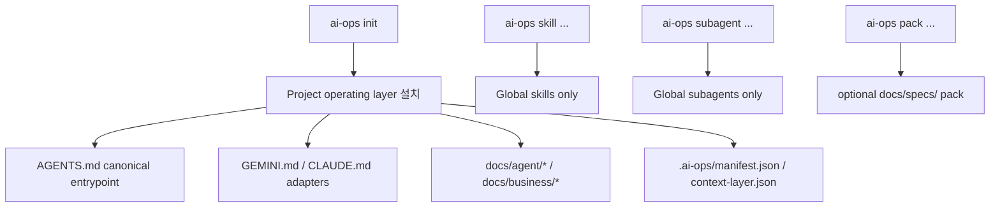

# ai-ops-cli

`ai-ops-cli`는 프로젝트에 AI agent operating layer를 설치하고, 사용자 환경에 agent skills/subagents를 설치하는 CLI입니다.

이 문서는 현재 구현된 breaking model을 설명합니다. old rules + skills scaffolder 모델은 deprecated 문맥으로만 남깁니다.

## Current Breaking Model



핵심 경계:

- project scope는 operating layer 문서만 관리합니다.
- global scope는 skills/subagents만 관리합니다.
- `AGENTS.md`가 canonical entrypoint입니다.
- `GEMINI.md`와 `CLAUDE.md`는 `AGENTS.md`를 기준으로 삼게 하는 adapter입니다.
- `docs/specs/`는 optional pack 위치입니다.
- global asset 명령은 `AI_OPS_HOME` 또는 `HOME`이 없으면 cwd fallback 없이 실패합니다.

## 설치 대상

Project repo:

```text
AGENTS.md
GEMINI.md
CLAUDE.md
docs/agent/workflow.md
docs/agent/rules/routing-rules.md
docs/agent/rules/doc-update-rules.md
docs/agent/rules/stop-rules.md
docs/agent/checks/impact-checklist.md
docs/agent/checks/review-checklist.md
docs/agent/maps/codebase-map.md
docs/business/business-rules.md
docs/docs-status.md
.ai-ops/manifest.json
.ai-ops/context-layer.json
```

Global tool home:

```text
skills/*
subagents/*
```

## 목표 CLI 표면

```text
ai-ops [command]

Commands:
  init       Install or refresh the project agent operating layer
  diff       Show drift in the project operating layer
  update     Re-apply the project operating layer
  audit      Check frontmatter, docs-status, manifest, and context-layer consistency
  uninstall  Remove project-managed operating layer files
  skill      Manage global agent skills
  subagent   Manage global agent subagents
  pack       Manage optional project operating layer packs
```

`--tool`은 유지합니다. Codex, Claude Code, Gemini CLI가 서로 다른 discovery 위치와 adapter 파일을 사용하기 때문입니다.

Skill lifecycle 명령:

```bash
ai-ops skill list
ai-ops skill install skill-load-check --tool codex
ai-ops skill install doc-impact-reviewer --tool codex
ai-ops skill diff
ai-ops skill update
ai-ops skill uninstall skill-load-check
```

`doc-impact-reviewer`는 변경 완료 또는 커밋 직전에 운영 문서 영향도를 확인하는 수동 task skill입니다. `$doc-impact-reviewer`로 호출하면 git status/diff를 보고 `required / recommended / not needed` 문서 후보와 미갱신 리스크를 제안합니다. 사용자 승인 전에는 문서를 수정하지 않고, 직접 staging/commit도 하지 않습니다.

Subagent lifecycle 명령:

```bash
ai-ops subagent list
ai-ops subagent install security-gate --tool codex
ai-ops subagent diff
ai-ops subagent update
ai-ops subagent uninstall security-gate
```

Subagent는 항상 global tool home에 설치됩니다. Codex는 `.codex/agents/<id>.toml`, Claude Code는 `.claude/agents/<id>.md`, Gemini CLI는 `.gemini/agents/<id>.md`를 사용하고, 상태는 `.ai-ops/subagents-manifest.json`에만 기록합니다.

Pack lifecycle 명령:

```bash
ai-ops init --tool codex
ai-ops pack list
ai-ops pack install spec-lifecycle
ai-ops pack diff spec-lifecycle
ai-ops pack update spec-lifecycle
ai-ops pack uninstall spec-lifecycle
```

`spec-lifecycle` pack은 `docs/specs/README.md`, `docs/specs/baseline/.gitkeep`, `docs/specs/initial-build/.gitkeep`를 설치합니다. Markdown 문서만 context-layer와 `docs/docs-status.md` 감사 대상이고, `.gitkeep`은 manifest의 일반 pack file로만 기록됩니다.

## Deprecated Old Model

다음 동작은 현재 코드나 과거 README에 남아 있을 수 있지만 새 계약에서는 제거 대상입니다.

- preset-first init UX
- project scope skill 설치
- `ai-ops skill install --project`
- project-installed skill metadata
- `.ai-ops-manifest.json`
- legacy manifest migration
- root `specs/`
- `ai-ops spec init`

기존 프로젝트 자동 마이그레이션은 제공하지 않습니다. 기존 사용자는 old CLI로 `ai-ops uninstall`을 실행한 뒤 새 major CLI로 `ai-ops init`을 다시 실행합니다.

## Old Model Command Notes

Deprecated old model 문맥에서만 아래 명령을 과거 project scope skill 설치 예시로 남깁니다. 현재 skill CLI는 global-only이며 `--project`, `--global`, `--scope`를 공개 옵션으로 제공하지 않습니다.

```bash
ai-ops skill install skill-load-check --project --tool codex
```

Deprecated old model 문맥에서만 유지되는 항목:

- `--project`는 project scope skill 설치용 old option입니다.
- `--global`, `--scope`는 skill scope를 직접 지정하던 old option입니다.
- `spec init`은 root `specs/`를 만들던 제거된 old command입니다.
- `.ai-ops-manifest.json`는 old project manifest입니다.

## 개발

저장소 루트 기준:

```bash
npm install
npm run build
npm run compile
npm test
```

CLI workspace만 확인할 때:

```bash
npm run build --workspace=apps/cli
npm run test --workspace=apps/cli
```

코드와 운영 문서 변경은 `npm run check`를 기본 검증으로 사용합니다. CLI 배포 산출물 확인은 `npm run build`와 `npm run compile`을 함께 사용합니다.

Self-dogfood 검증은 `npm run build` 후 이 repo에 `init --tool codex --tool gemini --tool claude-code`를 적용하고, `diff`, `audit`, `update --force`, `uninstall --yes`, 재-`init`, 재-`audit` 순서로 확인합니다. 이 repo에는 `spec-lifecycle` pack을 설치하지 않고 `pack list`에서 `not installed` 상태만 확인합니다.

## 관련 문서

- [Master blueprint](../../docs/plan.md)
- [Implementation playbook](../../docs/implementation-playbook.md)
