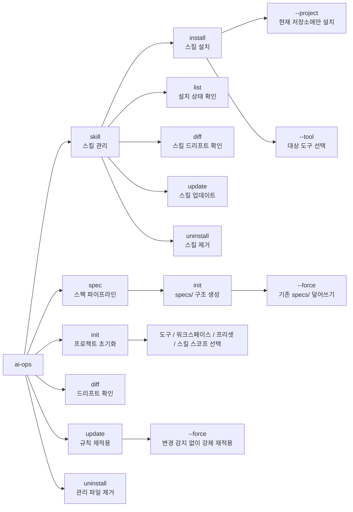

# ai-ops-cli

프로젝트 전반의 AI 도구 규칙과 에이전트 스킬을 관리하는 CLI입니다.

## 존재 이유

`ai-ops-cli`는 AI 코딩 도구 사이에서 설정이 조금씩 어긋나는 문제를 줄입니다.

- 도구마다 파일 배치와 로딩 방식이 다릅니다.
- 여러 도구에 규칙을 수동으로 동기화하면 시간이 지날수록 오류가 생기기 쉽습니다.
- 팀에는 공유 핵심 규칙과 설치 가능한 스킬을 결정적으로 구성하는 방식이 필요합니다.

이 CLI는 다음 항목을 서로 다른 단일 출처로 다룹니다.

- `apps/cli/data/rules/*.yaml`: 항상 로드되는 핵심 규칙만 포함
- `apps/cli/data/skills/skill-registry.json`: 스킬 설치 및 카탈로그 메타데이터
- `apps/cli/data/skills/reference-skills/<skill-id>/`: 설치 가능한 레퍼런스 스킬
- `apps/cli/data/skills/task-skills/<skill-id>/`: 설치 가능한 태스크 스킬
- `apps/cli/data/presets.yaml`: 프리셋과 핵심 규칙의 매핑

## 이 CLI가 제공하는 것

- 대화형 프로젝트 초기화(`ai-ops init`)
- 스킬 패키지 설치 및 생명주기 관리(`ai-ops skill ...`)
- 스펙 파이프라인 디렉터리 스캐폴딩(`ai-ops spec init`)
- 소스 드리프트 확인(`ai-ops diff`)
- 결정적 재적용(`ai-ops update`)
- 관리 대상 파일 정리(`ai-ops uninstall`)

## 지원 도구와 출력 구조

| 도구                        | 프로젝트 규칙 출력                                    | 스킬 출력                    |
| --------------------------- | ----------------------------------------------------- | ---------------------------- |
| Claude Code (`claude-code`) | `.claude/rules/<rule-id>.md`, `<workspace>/CLAUDE.md` | `.claude/skills/<skill-id>/` |
| Codex (`codex`)             | `AGENTS.md`, `<workspace>/AGENTS.override.md`         | `.agents/skills/<skill-id>/` |
| Gemini CLI (`gemini`)       | `GEMINI.md`, `<workspace>/GEMINI.md`                  | `.agents/skills/<skill-id>/` |

선택 설정 파일:

- Claude Code: `.claude/settings.local.json`
- Gemini CLI: `.gemini/settings.json`
- 포맷팅 보호 섹션: `.prettierignore`

## 설치

```bash
npm install -g ai-ops-cli
```

## 명령어 맵



## 사용법

```bash
# 현재 프로젝트 초기화
ai-ops init

# 스킬을 전역에 설치합니다. 기본값은 사용자 스코프입니다.
ai-ops skill install skill-load-check --tool codex

# 스킬을 현재 프로젝트에만 설치합니다.
ai-ops skill install skill-load-check --project --tool codex

# 설치된 스킬 확인 또는 업데이트
ai-ops skill list
ai-ops skill diff
ai-ops skill update
ai-ops skill uninstall skill-load-check

# 프로젝트 드리프트 확인
ai-ops diff

# 현재 프로젝트 상태 재적용
ai-ops update
ai-ops update --force

# 프로젝트 관리 대상 파일 제거
ai-ops uninstall

# 스펙 파이프라인 디렉터리 구조 초기화
ai-ops spec init

# specs/가 이미 있어도 강제로 다시 생성
ai-ops spec init --force
```

## CLI 표면

```text
ai-ops [command]

Commands:
  init       Initialize AI tool rules for a project
  skill      Manage agent skills
  spec       Manage spec pipeline
  update     Update installed rules
  diff       Show diff between installed and current rules
  uninstall  Remove installed rules and manifest

Options:
  --force        Force update even when no changes are detected (update only)
  -V, --version  Output version number
  -h, --help     Display help
```

### `ai-ops spec` 하위 명령

```text
ai-ops spec init [options]

  Initialize the specs/ directory structure for AI-collaborative spec pipelines.
  Creates:
    specs/README.md          — usage guide
    specs/baseline/          — baseline spec documents
    specs/delta/             — delta (incremental change) spec documents

Options:
  --force   Overwrite existing specs/ directory
```

참고:

- 프로젝트 설치 상태는 `.ai-ops-manifest.json`에 기록됩니다.
- 사용자 스코프 스킬 상태는 `~/.ai-ops/skills-manifest.json`에 기록됩니다.
- `ai-ops skill`은 기본적으로 사용자 스코프를 사용합니다. 스킬을 현재 저장소에만 두려면 `--project`를 사용하세요.

## 설치 / 업데이트 / 제거 동작

- 관리 대상 프로젝트 규칙 파일은 메타데이터(`sourceHash`, `generatedAt`)를 포함한 `ai-ops` 섹션으로 감싸집니다.
- 규칙 파일에 이미 `ai-ops` 섹션이 있으면 해당 섹션만 교체됩니다.
- 규칙 파일에 관리 섹션이 없으면 생성된 내용이 덧붙고 사용자 내용은 보존됩니다.
- 스킬 패키지는 전용 디렉터리에 기록되며, 업데이트 시 전체 패키지 트리 단위로 교체됩니다.
- `uninstall`은 프로젝트 관리 대상 규칙 파일과 프로젝트에 설치된 스킬 디렉터리만 제거합니다.
- 사용자 스코프 스킬은 `ai-ops uninstall`로 제거되지 않습니다.

## 초기화 흐름 요약

`ai-ops init`은 다음 항목을 묻습니다.

1. 도구 선택(`claude-code`, `codex`, `gemini`)
2. 모노레포 여부 확인
3. 모노레포의 경우 워크스페이스 선택
4. 워크스페이스별 프리셋 선택
5. 잠긴 핵심 규칙 검토
6. 프리셋에 연결된 `reference` 스킬만 표시:
   - 이미 설치된 전역 스킬은 별도로 표시됩니다.
   - 설치 가능한 스킬만 선택 해제할 수 있습니다.
7. 선택된 설치 가능 스킬에 적용할 공유 설치 스코프 하나 선택(`user` 기본값 또는 `project`)
8. 선택 설정 설치 여부

중요 동작:

- 핵심 규칙은 프리셋에서 직접 오며 `init`에서 세부 조정하지 않습니다.
- `init`은 프리셋에 연결된 `reference` 스킬만 보여줍니다.
- `task` 스킬은 `init`에서 제외되며 `ai-ops skill install/uninstall`로 관리합니다.
- 전역에서 이미 사용할 수 있는 스킬은 기본적으로 다시 설치하지 않습니다.
- `user` 스코프를 선택하면 선택된 스킬은 전역 스킬 레지스트리에만 기록됩니다.
- `project` 스코프를 선택하면 선택된 스킬은 `.ai-ops-manifest.json`에 기록됩니다.

스킬 작성 규칙은 `apps/cli/data/skills/README.md`에 있습니다.

## 로컬 개발

저장소 루트에서 실행:

```bash
npm install
npm run build
npm run compile
npm test
```

`apps/cli` 워크스페이스에서 실행:

```bash
npm run build --workspace=apps/cli
npm run test --workspace=apps/cli
```

## 로컬 스킬 로딩 확인

npm에 배포하기 전에 내장 `skill-load-check` 태스크 스킬을 사용하세요.

권장 로컬 흐름:

```bash
# 1. CLI 빌드
npm run build

# 2. 실제 ~/.agents 또는 ~/.claude를 오염시키지 않도록 격리된 사용자 홈을 사용합니다.
export AI_OPS_HOME="$(mktemp -d)"

# 3. 샘플 스킬을 전역에 설치합니다.
node apps/cli/dist/bin/index.js skill install skill-load-check --tool codex

# 4. 파일이 존재하는지 확인합니다.
find "$AI_OPS_HOME/.agents/skills/skill-load-check" -maxdepth 2 -type f | sort

# 5. 샘플 스크립트를 수동으로 실행합니다.
node "$AI_OPS_HOME/.agents/skills/skill-load-check/scripts/loaded.js"
```

예상 출력:

```text
A Skill loaded
```

프로젝트 스코프 확인:

```bash
node apps/cli/dist/bin/index.js skill install skill-load-check --project --tool codex
find ./.agents/skills/skill-load-check -maxdepth 2 -type f | sort
node ./.agents/skills/skill-load-check/scripts/loaded.js
```

파일 배치가 확인되면 `skill-load-check`가 트리거될 실제 도구 프롬프트를 사용해 도구가 스킬 메타데이터를 발견하는지 확인하세요. 도구가 스킬 발견 결과를 캐시한다면 다시 확인하기 전에 해당 도구 세션을 재시작하세요.

## 관련 문서

- 마스터 블루프린트: [`docs/plan.md`](../../docs/plan.md)
- 구현 플레이북: [`docs/implementation-playbook.md`](../../docs/implementation-playbook.md)

## 라이선스

MIT
