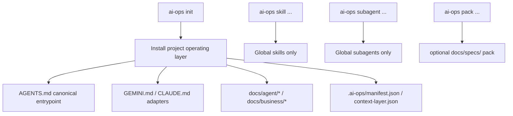

# ai-ops-cli

[Korean](./README.ko.md)

`ai-ops-cli` installs an AI agent operating layer into a project and installs reusable agent skills/subagents into the user's global tool environment.

This document describes the currently implemented breaking model. The old rules + skills scaffolder model remains only as deprecated context.

## Current Breaking Model



Core boundaries:

- Project scope manages only operating-layer documents.
- Global scope manages only skills/subagents.
- `AGENTS.md` is the canonical entrypoint.
- `GEMINI.md` and `CLAUDE.md` are adapters that point tools back to `AGENTS.md`.
- `docs/specs/` is the optional pack location.
- Global asset commands require `AI_OPS_HOME` or `HOME`; they fail closed without cwd fallback when neither exists.

## Install Targets

Project repo:

```text
AGENTS.md
GEMINI.md
CLAUDE.md
docs/agent/rules/00-agent-baseline.md
docs/agent/workflow.md
docs/agent/rules/routing-rules.md
docs/agent/rules/doc-update-rules.md
docs/agent/rules/stop-rules.md
docs/agent/checks/impact-checklist.md
docs/agent/checks/review-checklist.md
docs/agent/maps/codebase-map.md
docs/business/business-rules.md
docs/docs-status.md
.ai-ops/manifest.json
.ai-ops/context-layer.json
```

`docs/agent/rules/00-agent-baseline.md` is the Active rule that carries the original intent of the old `role-persona`, `communication`, `code-philosophy`, `naming-convention`, and `plan-mode` rules into the new operating layer. It is read immediately after `AGENTS.md`.

Global tool home:

```text
skills/*
subagents/*
```

## Editing FAQ

### What does `ai-ops update` overwrite?

`AGENTS.md`, `GEMINI.md`, `CLAUDE.md`, `docs/agent/rules/*`, `docs/agent/checks/*`, and `docs/agent/workflow.md` are ai-ops managed documents. In these files, the region from `<!-- ai-ops:start -->` through `<!-- ai-ops:end -->` is CLI template content. `ai-ops update` reapplies the current CLI template to that region. User edits inside that region are not preserved across update.

`.ai-ops/manifest.json` and `.ai-ops/context-layer.json` are also not direct-edit files. They are CLI state files for installation state and document indexing.

### Which files should users edit directly?

Project knowledge belongs in project-owned documents. The default project-owned documents are `docs/agent/maps/codebase-map.md`, `docs/business/business-rules.md`, and `docs/docs-status.md`. `docs/agent/maps/codebase-map.md` and `docs/business/business-rules.md` start as Reserved templates, but once the project fills them with real content, update does not automatically overwrite them.

`docs/docs-status.md` is project-owned, but it is not a free-form notebook. It is the context-layer registry. Update it together with document status/frontmatter changes; the update flow may also normalize its table from the manifest and current document frontmatter.

### Where should project-specific agent rules go?

The default layer currently has project-owned documents for project structure and business rules, but it does not yet provide a first-class Active template for project-specific agent behavior rules. Because of that, adding rules inside the managed region of `AGENTS.md` or inside a tool adapter is not an update-safe contract.

To support project-specific agent rules safely, the next product extension should add a project-owned Active document such as `docs/agent/rules/project-rules.md` and have the manifest, context-layer index, and docs-status table track it together.

## CLI Surface

```text
ai-ops [command]

Commands:
  init       Install or refresh the project agent operating layer
  diff       Show drift in the project operating layer
  update     Re-apply the project operating layer
  audit      Check frontmatter, docs-status, manifest, and context-layer consistency
  uninstall  Remove project-managed operating layer files
  skill      Manage global agent skills
  subagent   Manage global agent subagents
  pack       Manage optional project operating layer packs
  context-promotion Manage context promotion review receipts
  codex-hook Manage Codex hook integration
```

`--tool` remains because Codex, Claude Code, and Gemini CLI use different discovery locations and adapter files.

Skill lifecycle commands:

```bash
ai-ops skill list
ai-ops skill install skill-load-check --tool codex
ai-ops skill install doc-impact-reviewer --tool codex
ai-ops skill install context-promotion-review --tool codex
ai-ops skill diff
ai-ops skill update
ai-ops skill uninstall skill-load-check
```

`doc-impact-reviewer` is a manual task skill for checking operating-document impact near the end of work or before commit. Invoking `$doc-impact-reviewer` reads git status/diff and reports document update candidates as `required / recommended / not needed`. It does not edit documents, stage files, or commit before user approval.

`context-promotion-review` is a Codex-only task skill for checking whether the just-created work commit produced reusable operating knowledge that should be promoted to core, project-local, or global context. The Codex hook runs after `git commit`, never blocks the work commit, and any approved promotion edits stay uncommitted until the user reviews them. Installing the hook also installs the Codex skill globally. It records the final decision with `ai-ops context-promotion resolve`.

Context promotion and Codex hook commands:

```bash
ai-ops context-promotion status
ai-ops context-promotion resolve --decision no-promotion --summary "No reusable operating knowledge found"
ai-ops context-promotion prune --max 50
ai-ops codex-hook install context-promotion
ai-ops codex-hook install context-promotion --command "/custom/bin/ai-ops context-promotion hook post-tool-use"
ai-ops codex-hook status context-promotion
ai-ops codex-hook uninstall context-promotion
```

Subagent lifecycle commands:

```bash
ai-ops subagent list
ai-ops subagent install security-gate --tool codex
ai-ops subagent diff
ai-ops subagent update
ai-ops subagent uninstall security-gate
```

Subagents are always installed into the global tool home. Codex uses `.codex/agents/<id>.toml`, Claude Code uses `.claude/agents/<id>.md`, Gemini CLI uses `.gemini/agents/<id>.md`, and state is recorded only in `.ai-ops/subagents-manifest.json`.

Pack lifecycle commands:

```bash
ai-ops init --tool codex
ai-ops pack list
ai-ops pack install spec-lifecycle
ai-ops pack diff spec-lifecycle
ai-ops pack update spec-lifecycle
ai-ops pack uninstall spec-lifecycle
```

The `spec-lifecycle` pack installs `docs/specs/README.md`, `docs/specs/README.ko.md`, `docs/specs/baseline/.gitkeep`, and `docs/specs/initial-build/.gitkeep`. Only Markdown documents are audited by the context-layer and `docs/docs-status.md`; `.gitkeep` files are tracked only as regular pack files in the manifest.

## Deprecated Old Model

The following behaviors may still appear in current code or older docs, but they are outside the new contract:

- preset-first init UX
- project-scope skill installation
- `ai-ops skill install --project`
- project-installed skill metadata
- `.ai-ops-manifest.json`
- legacy manifest migration
- root `specs/`
- `ai-ops spec init`

Existing projects are not migrated automatically. Existing users should run `ai-ops uninstall` with the old CLI, then run `ai-ops init` again with the new major CLI.

## Old Model Command Notes

The command below remains only as a deprecated old-model example for historical project-scope skill installation. The current skill CLI is global-only and does not expose `--project`, `--global`, or `--scope` as public options.

```bash
ai-ops skill install skill-load-check --project --tool codex
```

Deprecated old-model-only items:

- `--project` was the old option for project-scope skill installation.
- `--global` and `--scope` were old options for directly selecting skill scope.
- `spec init` was the removed old command that created root `specs/`.
- `.ai-ops-manifest.json` was the old project manifest.

## Development

From the repository root:

```bash
npm install
npm run build
npm run compile
npm test
```

To check only the CLI workspace:

```bash
npm run build --workspace=apps/cli
npm run test --workspace=apps/cli
```

Use `npm run check` as the default validation for code and operating-document changes. For CLI release artifacts, run both `npm run build` and `npm run compile`.

Self-dogfood validation runs `npm run build`, applies `init --tool codex --tool gemini --tool claude-code` to this repo, then checks `diff`, `audit`, `update --force`, `uninstall --yes`, re-`init`, and re-`audit`. This repo does not install the `spec-lifecycle` pack during self-dogfood; `pack list` only verifies the `not installed` state.

## Related Docs

- [Master blueprint](../../docs/plan.md)
- [Implementation playbook](../../docs/implementation-playbook.md)
