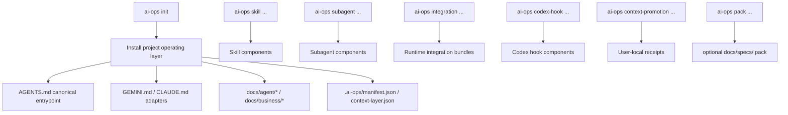

# ai-ops-cli

[Korean](./README.ko.md)

`ai-ops-cli` installs and manages the operating layer and global runtime integrations needed for project/agent work.

This document describes the currently implemented breaking model. The current CLI exposes `integration` commands for bundled user/global runtime workflows and keeps low-level component commands for skills, subagents, Codex hooks, and user-local receipts. The old rules + skills scaffolder model remains only as deprecated context.

## Current Breaking Model



Core boundaries:

- Project scope manages only operating-layer documents.
- Integration scope manages only user/global runtime workflow.
- Skills, subagents, Codex hooks, and user-local receipts/config are integration components.
- `AGENTS.md` is the canonical entrypoint.
- `GEMINI.md` and `CLAUDE.md` are adapters that point tools back to `AGENTS.md`.
- `docs/specs/` is the optional pack location.
- Integration component commands require `AI_OPS_HOME` or `HOME`; they fail closed without cwd fallback when neither exists.

## Install Targets

Project repo:

```text
AGENTS.md
GEMINI.md
CLAUDE.md
docs/agent/rules/00-agent-baseline.md
docs/agent/workflow.md
docs/agent/terminology.md
docs/agent/rules/routing-rules.md
docs/agent/rules/doc-update-rules.md
docs/agent/rules/stop-rules.md
docs/agent/checks/impact-checklist.md
docs/agent/maps/codebase-map.md
docs/business/terminology.md
docs/business/business-rules.md
docs/docs-status.md
.ai-ops/manifest.json
.ai-ops/context-layer.json
```

`docs/agent/rules/00-agent-baseline.md` is the Active rule that carries the original intent of the old `role-persona`, `communication`, `code-philosophy`, `naming-convention`, and `plan-mode` rules into the new operating layer. It is read immediately after `AGENTS.md`.

User/global runtime component home:

```text
skills/*
subagents/*
hooks/*
receipts/config/*
```

## Editing FAQ

### What does `ai-ops update` overwrite?

`AGENTS.md`, `GEMINI.md`, `CLAUDE.md`, `docs/agent/rules/*`, `docs/agent/checks/impact-checklist.md`, and `docs/agent/workflow.md` are ai-ops managed documents. In these files, the region from `<!-- ai-ops:start -->` through `<!-- ai-ops:end -->` is CLI template content. `ai-ops update` reapplies the current CLI template to that region. User edits inside that region are not preserved across update.

`docs/agent/project-rules/*.md` is project-owned and is not overwritten by `ai-ops update --force`.

`.ai-ops/manifest.json` and `.ai-ops/context-layer.json` are also not direct-edit files. They are CLI state files for installation state and document indexing.

### Which files should users edit directly?

Project knowledge belongs in project-owned documents. The default project-owned documents are `docs/agent/maps/codebase-map.md`, `docs/business/terminology.md`, `docs/business/business-rules.md`, and `docs/docs-status.md`. Project-specific agent behavior rules belong in `docs/agent/project-rules/*.md`. `docs/agent/maps/codebase-map.md`, `docs/business/terminology.md`, and `docs/business/business-rules.md` start as Reserved templates, but once the project fills them with real content, update does not automatically overwrite them.

`docs/docs-status.md` is project-owned, but it is not a free-form notebook. It is the context-layer registry. Update it together with document status/frontmatter changes; the update flow may also normalize its table from the manifest and current document frontmatter.

### Where should project-specific agent rules go?

Use `docs/agent/project-rules/*.md`. Files in this directory are project-owned context documents when they have valid operating-layer frontmatter. `ai-ops update`, `diff`, and `audit` discover them, track them in `.ai-ops/manifest.json`, `.ai-ops/context-layer.json`, and `docs/docs-status.md`, and preserve their content across forced updates.

## CLI Surface

```text
ai-ops [command]

Commands:
  init       Install or refresh the project agent operating layer
  diff       Show drift in the project operating layer
  update     Re-apply the project operating layer
  audit      Check frontmatter, docs-status, manifest, and context-layer consistency
  uninstall  Remove project-managed operating layer files
  skill      Manage skill components
  subagent   Manage subagent components
  pack       Manage optional project operating layer packs
  studio    Launch ai-ops Studio or generate read-only Studio helpers
  integration Manage user/global runtime integrations
  context-promotion Manage context promotion review receipts
  codex-hook Manage Codex hook components
```

`--tool` remains because Codex, Claude Code, and Gemini CLI use different discovery locations and adapter files.

Studio desktop launcher:

```bash
ai-ops studio .
ai-ops studio /path/to/project
```

The launcher currently supports macOS arm64 through the optional `ai-ops-studio-darwin-arm64` platform package. It passes the target project root to the desktop app and does not mutate project/runtime files.

Studio read-only snapshot command:

```bash
ai-ops studio snapshot --json
```

This emits the JSON contract consumed by ai-ops Studio. It reads the project context layer, audit state, and user/global runtime status without launching the desktop app or mutating project/runtime files.

Integration lifecycle commands:

```bash
ai-ops integration list
ai-ops integration install context-promotion
ai-ops integration install pc
ai-ops integration status pc
ai-ops integration uninstall pc
ai-ops pc status
ai-ops pc done draft --cwd /path/to/product-repo
ai-ops pc done apply --draft /path/to/draft.json
```

`context-promotion` bundles the `context-promotion-review` Codex skill, a shared Codex `PostToolUse` hook workflow, and user-local receipt workflow.

`pc` bundles the `pc` Codex skill and the same shared Codex `PostToolUse` hook runner. It prompts Codex to run `$pc:done` after a successful `git commit` only when `~/.personal-project-contexts/` already has a matching workspace, active workstream, and current repo scope. Handoff writes use `ai-ops pc done draft` -> AI fills JSON -> `ai-ops pc done apply`, so the CLI owns context file updates and the context repo commit.

Integration ownership is tracked in `.ai-ops/integrations-manifest.json` under the user/global runtime home. Uninstall removes only owned components and preserves pre-existing manual installs.

Skill lifecycle commands:

```bash
ai-ops skill list
ai-ops skill install skill-load-check --tool codex
ai-ops skill install doc-impact-reviewer --tool codex
ai-ops skill install context-promotion-review --tool codex
ai-ops skill diff
ai-ops skill update
ai-ops skill uninstall skill-load-check
```

`doc-impact-reviewer` is a manual task skill for checking operating-document impact near the end of work or before commit. Invoking `$doc-impact-reviewer` reads git status/diff and reports document update candidates as `required / recommended / not needed`. It does not edit documents, stage files, or commit before user approval.

`context-promotion-review` is a Codex-only task skill for checking whether the just-created work commit produced reusable operating knowledge that should be promoted to core, project-local, or global context. The shared Codex hook workflow runs after `git commit`, never blocks the work commit, and any approved promotion edits stay uncommitted until the user reviews them. Installing the hook also installs the Codex skill into the user/global runtime location. It records the final decision with `ai-ops context-promotion resolve`.

Low-level component commands remain available for direct skill, hook, and receipt management.

Context promotion and Codex hook commands:

```bash
ai-ops context-promotion status
ai-ops context-promotion resolve --decision no-promotion --summary "No reusable operating knowledge found"
ai-ops context-promotion prune --max 50
ai-ops codex-hook install context-promotion
ai-ops codex-hook install context-promotion --command "/custom/bin/ai-ops integration hook post-tool-use"
ai-ops codex-hook install context-promotion --command-windows "C:\tools\ai-ops.exe integration hook post-tool-use"
ai-ops codex-hook status context-promotion
ai-ops codex-hook uninstall context-promotion
ai-ops codex-permissions install safe-local
ai-ops codex-permissions status safe-local
ai-ops codex-permissions uninstall safe-local
```

The installed hook command is the shared dispatcher form `ai-ops integration hook post-tool-use --workflows ...`. If multiple workflows such as `context-promotion` and `pc` are installed, ai-ops keeps one Codex `PostToolUse` command hook and merges continuation output. Review and trust the configured non-managed hook with Codex `/hooks` before expecting it to run.

`safe-local` manages a user-level Codex permission profile named `ai-ops-safe-local` in `~/.codex/config.toml`. It grants write access to `~/.personal-project-contexts`, `${AI_OPS_HOME:-$HOME}/.ai-ops/context-promotion`, and `.codex/plans` under active workspace roots while keeping `.git` read-only. It prefers the current Codex permission syntax (`:workspace_roots` plus `deny` env-file carveouts), validates the generated profile against the installed Codex runtime, and chooses the first accepted syntax. If Codex validation is unavailable, it uses a portable compatibility syntax with a warning; if Codex is available but no candidate validates, it fails closed without writing `config.toml`. It does not install `PermissionRequest` hooks or command allow rules.

For an ai-coding worker, keep Codex subprocesses run-scoped and let the orchestrator own commits, pushes, and PR creation:

```bash
codex exec --ignore-user-config --ignore-rules --cd "$WORKTREE" \
  -c 'approval_policy="never"' \
  -c 'default_permissions=":read-only"'

codex exec --ignore-user-config --ignore-rules --cd "$WORKTREE" \
  -c 'approval_policy="never"' \
  -c 'default_permissions="ai-worker-impl"' \
  -c 'permissions.ai-worker-impl.filesystem.glob_scan_max_depth=3' \
  -c 'permissions.ai-worker-impl.filesystem.":minimal"="read"' \
  -c 'permissions.ai-worker-impl.filesystem.":workspace_roots"."."="write"' \
  -c 'permissions.ai-worker-impl.filesystem.":workspace_roots".".git"="read"' \
  -c 'permissions.ai-worker-impl.filesystem.":workspace_roots".".codex"="read"' \
  -c 'permissions.ai-worker-impl.filesystem.":workspace_roots".".codex/plans"="write"' \
  -c 'permissions.ai-worker-impl.filesystem.":workspace_roots"."**/*.env"="deny"' \
  -c 'permissions.ai-worker-impl.network.enabled=false'
```

When adding env-file carveouts to run-scoped worker profiles, validate the exact TOML syntax against the installed Codex runtime; `safe-local` performs that validation automatically for its managed profile.

After each Codex run, the orchestrator should verify HEAD, branch refs, and changed-file scope. The orchestrator, not Codex, should run validation commands, create commits, push branches, and call `gh pr create --draft`.

Subagent lifecycle commands:

```bash
ai-ops subagent list
ai-ops subagent install security-gate --tool codex
ai-ops subagent diff
ai-ops subagent update
ai-ops subagent uninstall security-gate
```

Subagents are always installed into the user/global runtime home. Codex uses `.codex/agents/<id>.toml`, Claude Code uses `.claude/agents/<id>.md`, Gemini CLI uses `.gemini/agents/<id>.md`, and state is recorded only in `.ai-ops/subagents-manifest.json`.

Pack lifecycle commands:

```bash
ai-ops init --tool codex
ai-ops pack list
ai-ops pack install spec-lifecycle
ai-ops pack diff spec-lifecycle
ai-ops pack update spec-lifecycle
ai-ops pack uninstall spec-lifecycle
```

The `spec-lifecycle` pack installs `docs/specs/README.md`, `docs/specs/README.ko.md`, `docs/specs/baseline/.gitkeep`, and `docs/specs/initial-build/.gitkeep`. Only Markdown documents are audited by the context-layer and `docs/docs-status.md`; `.gitkeep` files are tracked only as regular pack files in the manifest. Project terminology remains centralized in `docs/business/terminology.md`.

## Deprecated Old Model

The following behaviors may still appear in current code or older docs, but they are outside the new contract:

- preset-first init UX
- project-scope skill installation
- `ai-ops skill install --project`
- project-installed skill metadata
- `.ai-ops-manifest.json`
- legacy manifest migration
- root `specs/`
- `ai-ops spec init`

Existing projects are not migrated automatically. Existing users should run `ai-ops uninstall` with the old CLI, then run `ai-ops init` again with the new major CLI.

## Old Model Command Notes

The command below remains only as a deprecated old-model example for historical project-scope skill installation. The current skill CLI is global-only and does not expose `--project`, `--global`, or `--scope` as public options.

```bash
ai-ops skill install skill-load-check --project --tool codex
```

Deprecated old-model-only items:

- `--project` was the old option for project-scope skill installation.
- `--global` and `--scope` were old options for directly selecting skill scope.
- `spec init` was the removed old command that created root `specs/`.
- `.ai-ops-manifest.json` was the old project manifest.

## Development

From the repository root:

```bash
npm install
npm run build
npm run compile
npm test
```

To check only the CLI workspace:

```bash
npm run build --workspace=apps/cli
npm run test --workspace=apps/cli
```

Use `npm run check` as the default validation for code and operating-document changes. For CLI release artifacts, run both `npm run build` and `npm run compile`.

Self-dogfood validation runs `npm run build`, applies `init --tool codex --tool gemini --tool claude-code` to this repo, then checks `diff`, `audit`, `update --force`, `uninstall --yes`, re-`init`, and re-`audit`. This repo does not install the `spec-lifecycle` pack during self-dogfood; `pack list` only verifies the `not installed` state.

## Related Docs

- [Master blueprint](../../docs/plan.md)
- [Implementation playbook](../../docs/implementation-playbook.md)
