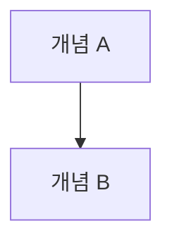

# 01_glossary.md Template

```md
# 01 Glossary

용어 표기 원칙:

- `용어` 칼럼은 한국어 우선이지만, 업계 표준 영어가 더 명확하면 영어 원형을 그대로 쓴다.
- `소스 오브 트루스` 같은 어색한 음역 대신 `source of truth` 또는 한국어 설명형 표현을 사용한다.

## 핵심 용어

| 용어 | 영문 / 코드명 | 정의 | 사용 범위 | 허용 별칭 | 금지 표현 | 관련 문서 |
|---|---|---|---|---|---|---|
| 용어 1 | `termName` | 짧은 정의 | brief / spec / ui | 별칭 1 | 금지 표현 1 | `10_product-spec.md` |

## 엔티티 용어

| 용어 | 영문 / 코드명 | 정의 | 사용 범위 | 허용 별칭 | 금지 표현 | 관련 문서 |
|---|---|---|---|---|---|---|
| 엔티티 1 | `entityName` | 짧은 정의 | spec / packet | 별칭 1 | 금지 표현 1 | `10_product-spec.md` |

## 상태 용어

| 용어 | 영문 / 코드명 | 정의 | 사용 범위 | 허용 별칭 | 금지 표현 | 관련 문서 |
|---|---|---|---|---|---|---|
| 상태 1 | `draft` | 짧은 정의 | spec / ui / packet | 별칭 1 | 금지 표현 1 | `10_product-spec.md` |

## UI 용어

| 용어 | 영문 / 코드명 | 정의 | 사용 범위 | 허용 별칭 | 금지 표현 | 관련 문서 |
|---|---|---|---|---|---|---|
| UI 용어 1 | `labelName` | 짧은 정의 | ui / packet | 별칭 1 | 금지 표현 1 | `20_ui-spec.md` |

## 금지하거나 피할 표현

| 표현 | 이유 | 대신 사용할 표현 |
|---|---|---|
| 표현 1 | 왜 피해야 하는지 | 표준 표현 |

## 복잡한 개념 상세 설명

### 개념 1

- 왜 이 개념이 표만으로는 충분하지 않은지 설명
- 어떤 문맥에서 다른 표현과 충돌하는지 설명



## 정의 충돌 / 검토 필요

| 항목 | 현재 표준 | 충돌 표현 | 판단 메모 |
|---|---|---|---|
| 충돌 항목 | 현재 표준 표현 | 새로 발견된 표현 | 판단 메모 |
```
