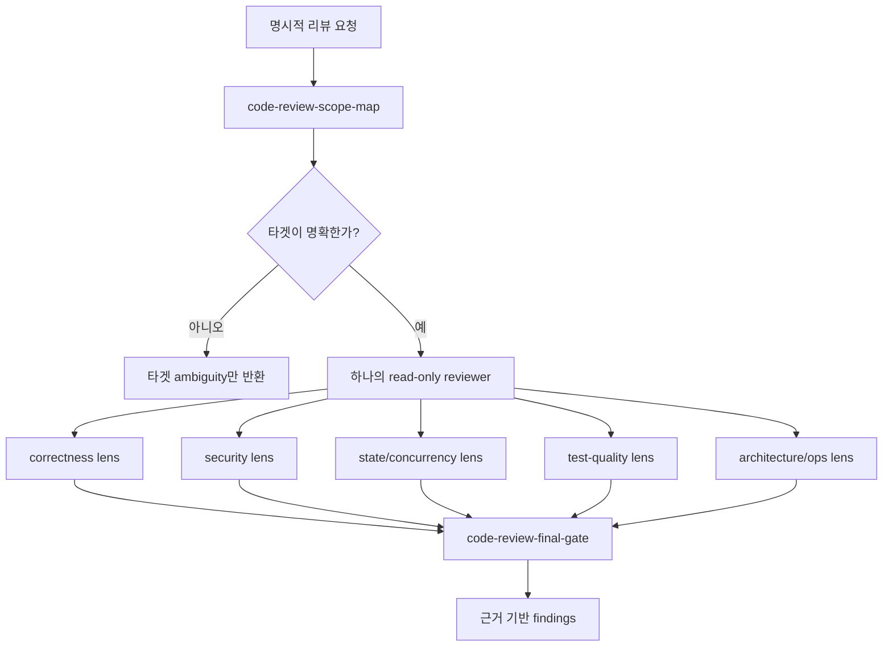

# code-review-gate

[English](./README.md)

`code-review-gate`는 Codex 전용, 명시 호출 전용, 읽기 전용 리뷰 orchestrator입니다. 핵심 모델은 하나의 read-only reviewer가 scope map 안에서 여러 focused review lens를 적용한 뒤, 결과를 중복 제거해 간결한 finding으로 정리하는 것입니다.

이 README는 maintainer를 위한 source 문서입니다. 설치된 Codex custom agent에 자동으로 로드되지 않습니다. 런타임 계약은 `PROMPT.md`에 있으며, renderer는 이 내용을 Codex agent TOML의 `developer_instructions`로 기록합니다. `codex.frontmatter.toml`은 설치된 skill 경로를 `skills.config`로 공급합니다.

## 리뷰어 모델

Focused pass들은 lens이며, 자동으로 병렬 fan-out되는 별도 reviewer agent들이 아닙니다. Reviewer는 모든 pass를 scope map의 included surface 안에 유지하고, out-of-scope risk는 remaining verification으로만 기록합니다.

## 타겟 선정

깊은 리뷰를 시작하기 전에 target mode를 정확히 하나 고릅니다.

| Mode | 사용 조건 | 주요 surface |
| --- | --- | --- |
| `plan_current_changes` | named plan을 현재 worktree와 비교할 때 | plan file, staged/unstaged/untracked implementation files, 직접 관련 tests/docs |
| `plan_head_commit` | `HEAD`, last commit, 또는 named plan을 구현한 `HEAD`를 요청할 때 | `git show HEAD`, changed files, 직접 관련 context, 선택적 plan file |
| `project_wide` | 사용자가 whole-project review를 요청할 때 | 우선순위 entrypoints, registries/schemas, CLI commands, docs/status, important tests |
| `feature` | 사용자가 feature 또는 product/CLI capability를 이름으로 지정할 때 | matched routes/commands/modules, docs, tests, configs, 직접 연결된 shared policy/schema/test helper code |
| `module` | 사용자가 paths, packages, directories, modules, symbols를 줄 때 | explicit paths 우선, 직접 연결된 imports/exports, package files, schemas/configs, tests, docs |
| `diff_default` | 타겟이 없거나 bare current changes/current diff review를 요청할 때 | current staged/unstaged diff, untracked implementation files, 직접 관련 tests/docs |

타겟이 여전히 모호하면 focused pass 전에 멈추고 최소한의 target clarification을 요청합니다. 넓은 리뷰 타겟을 추측하지 않습니다.

## 컨텍스트 관리

- `AGENTS.md`, `docs/agent/rules/00-agent-baseline.md`, `docs/agent/workflow.md`, 관련 `Active` operating-layer 문서를 judgment criteria로 취급합니다.
- Baseline operating-layer 문서를 automatic finding surface로 취급하지 않습니다. Scope map에 포함될 때만 직접 리뷰합니다.
- `code-review-scope-map`에서 시작합니다. 이 단계가 evidence, excluded surface, required read-only commands를 제한합니다.
- Target risk로 정당화되는 lens만 실행합니다. Surface가 작을 때 모든 lens를 매번 끌어오지 않습니다.
- 큰 raw command output을 review context로 복사하기보다 distilled evidence와 file/line reference를 우선합니다.
- `project_wide`에서는 complete coverage를 주장하지 않습니다. 샘플링한 surface와 제외한 surface를 명시합니다.

## 리뷰 렌즈

| Lens | 주로 보는 것 |
| --- | --- |
| `code-review-scope-map` | target mode, included surface, excluded surface, required read-only evidence, ambiguity |
| `code-review-correctness` | requirement mismatch, behavior regression, compatibility, edge cases, error handling |
| `code-review-security` | auth/authz, ownership, secret/PII exposure, sandbox/command/filesystem/network boundaries, implicit automation |
| `code-review-state-concurrency` | manifest/file lifecycle, partial updates, stale reads, retry/rerun idempotency, ordering and race risks |
| `code-review-test-quality` | missing or weak regression tests, happy-path-only coverage, misleading mocks/snapshots, e2e gaps |
| `code-review-architecture-ops` | ownership boundaries, migration/update/rollback/uninstall risk, diagnostics, performance, stale docs/runbooks |
| `code-review-final-gate` | dedupe, severity ordering, actionable evidence-backed findings, verification summary |
