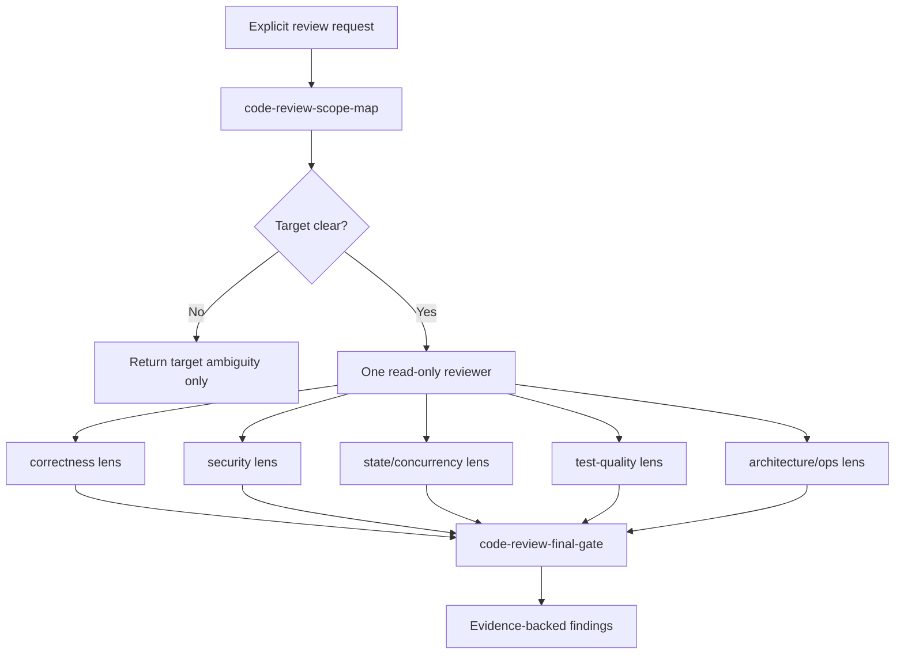

# code-review-gate

[Korean](./README.ko.md)

`code-review-gate` is a Codex-only, explicit-only, read-only review orchestrator. Its core model is one read-only reviewer applying multiple focused review lenses inside a scope map, then deduping the results into concise findings.

This README is source documentation for maintainers. It is not loaded automatically into the installed Codex custom agent. The runtime contract lives in `PROMPT.md`, which the renderer writes into the Codex agent TOML as `developer_instructions`; `codex.frontmatter.toml` supplies the installed skill paths through `skills.config`.

## Reviewer Model

The focused passes are lenses, not separate reviewer agents that automatically fan out in parallel. The reviewer keeps every pass inside the scope map's included surface and records out-of-scope risk only as remaining verification.

## Target Selection

Pick exactly one target mode before deep review:

| Mode | Use when | Main surface |
| --- | --- | --- |
| `plan_current_changes` | A named plan is compared against the current worktree | Plan file, staged/unstaged/untracked implementation files, directly related tests/docs |
| `plan_head_commit` | `HEAD`, last commit, or a named plan implemented by `HEAD` is requested | `git show HEAD`, changed files, directly related context, optional plan file |
| `project_wide` | The user asks for a whole-project review | Prioritized entrypoints, registries/schemas, CLI commands, docs/status, important tests |
| `feature` | The user names a feature or product/CLI capability | Matched routes/commands/modules, docs, tests, configs, directly connected shared policy/schema/test helper code |
| `module` | The user gives paths, packages, directories, modules, or symbols | Explicit paths first, then direct imports/exports, package files, schemas/configs, tests, docs |
| `diff_default` | No target is supplied, or the user asks for bare current changes/current diff review | Current staged/unstaged diff, untracked implementation files, directly related tests/docs |

If the target remains ambiguous, stop before focused passes and ask for the minimum target clarification. Do not guess a broad review target.

## Context Management

- Treat `AGENTS.md`, `docs/agent/rules/00-agent-baseline.md`, `docs/agent/workflow.md`, and related `Active` operating-layer documents as judgment criteria.
- Do not treat baseline operating-layer documents as automatic finding surfaces. Review them directly only when the scope map includes them.
- Start with `code-review-scope-map`; it bounds evidence, excluded surface, and required read-only commands.
- Run only the lenses justified by the target risk; do not pull every lens into every review when the surface is small.
- Prefer distilled evidence and file/line references over copying large raw command output into the review context.
- For `project_wide`, never claim complete coverage; name sampled and excluded surfaces.

## Review Lenses

| Lens | Mainly checks |
| --- | --- |
| `code-review-scope-map` | Target mode, included surface, excluded surface, required read-only evidence, ambiguity |
| `code-review-correctness` | Requirement mismatch, behavior regression, compatibility, edge cases, error handling |
| `code-review-security` | Auth/authz, ownership, secret/PII exposure, sandbox/command/filesystem/network boundaries, implicit automation |
| `code-review-state-concurrency` | Manifest/file lifecycle, partial updates, stale reads, retry/rerun idempotency, ordering and race risks |
| `code-review-test-quality` | Missing or weak regression tests, happy-path-only coverage, misleading mocks/snapshots, e2e gaps |
| `code-review-architecture-ops` | Ownership boundaries, migration/update/rollback/uninstall risk, diagnostics, performance, stale docs/runbooks |
| `code-review-final-gate` | Dedupe, severity ordering, actionable evidence-backed findings, verification summary |
