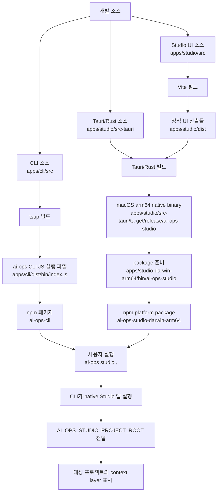

# Studio Launcher Architecture

이 문서는 `ai-ops studio .` 글로벌 launcher, Studio desktop shell, Vite UI, Tauri/Rust bridge, npm platform package의 관계를 설명한다.

## 핵심 용어

- `tsup`: TypeScript CLI 소스를 Node.js에서 실행 가능한 bundled JavaScript로 만드는 빌드 도구다. 이 repo에서는 `apps/cli/src/bin/index.ts`를 `apps/cli/dist/bin/index.js`로 만든다.
- `Vite UI`: Studio의 React 화면이다. `apps/studio/src`를 browser/webview가 읽을 수 있는 정적 파일로 빌드한다.
- `Tauri`: 웹 UI를 desktop app으로 감싸는 프레임워크다. macOS 창, 앱 생명주기, OS 접근, Rust command bridge를 담당한다.
- `Rust native shell`: 사용자의 OS에서 실제로 실행되는 desktop app 껍데기다. Vite가 만든 UI를 앱 창 안에 띄우고, 필요한 로컬 작업을 Rust command로 수행한다.
- `local backend`: 원격 서버가 아니라 desktop app 내부 bridge다. React UI가 직접 파일/프로세스에 접근하지 않고 Tauri `invoke`로 Rust command를 호출한다.
- `platform package`: OS/CPU별 native binary를 담는 npm package다. v1은 `ai-ops-studio-darwin-arm64`만 지원한다.

## Next.js와 다른 점

Next.js의 backend는 보통 HTTP server나 API route다. Studio의 backend는 사용자의 컴퓨터 안에서만 도는 local bridge다.

Studio UI는 다음 경로로 project snapshot을 읽는다.

```text
React UI
  -> Tauri invoke
  -> Rust command
  -> node ai-ops studio snapshot --json
  -> JSON 반환
  -> React UI 렌더링
```

이 구조가 필요한 이유는 browser/webview UI가 보안상 로컬 파일, 프로세스, 환경변수에 직접 접근하지 않기 때문이다.

## Build And Publish Flow



## Runtime Flow

1. 사용자가 project root에서 `ai-ops studio .`를 실행한다.
2. `ai-ops-cli`가 현재 OS/CPU를 확인한다.
3. macOS arm64이면 `ai-ops-studio-darwin-arm64/bin/ai-ops-studio`를 찾는다.
4. CLI가 native binary를 실행하면서 `AI_OPS_STUDIO_PROJECT_ROOT`와 `AI_OPS_CLI_BIN`을 전달한다.
5. Tauri/Rust shell이 앱 창을 열고 Vite UI를 표시한다.
6. UI가 snapshot이 필요할 때 Tauri `invoke`로 Rust command를 호출한다.
7. Rust command가 `node <AI_OPS_CLI_BIN> studio snapshot --json`을 대상 project root에서 실행한다.
8. 반환된 JSON을 UI가 Project Overview, Context Graph, Documents, Audit, Runtime view로 렌더링한다.

## Update Triggers

다음이 바뀌면 이 문서를 갱신한다.

- `ai-ops studio [project]` launcher contract
- `AI_OPS_STUDIO_PROJECT_ROOT` 또는 `AI_OPS_CLI_BIN` env contract
- Studio snapshot 호출 방식
- Tauri command bridge 구조
- Vite build output 위치
- Studio native binary build 위치
- `ai-ops-studio-darwin-arm64` package 이름, OS/CPU scope, 포함 파일
- release script 또는 publish 순서
