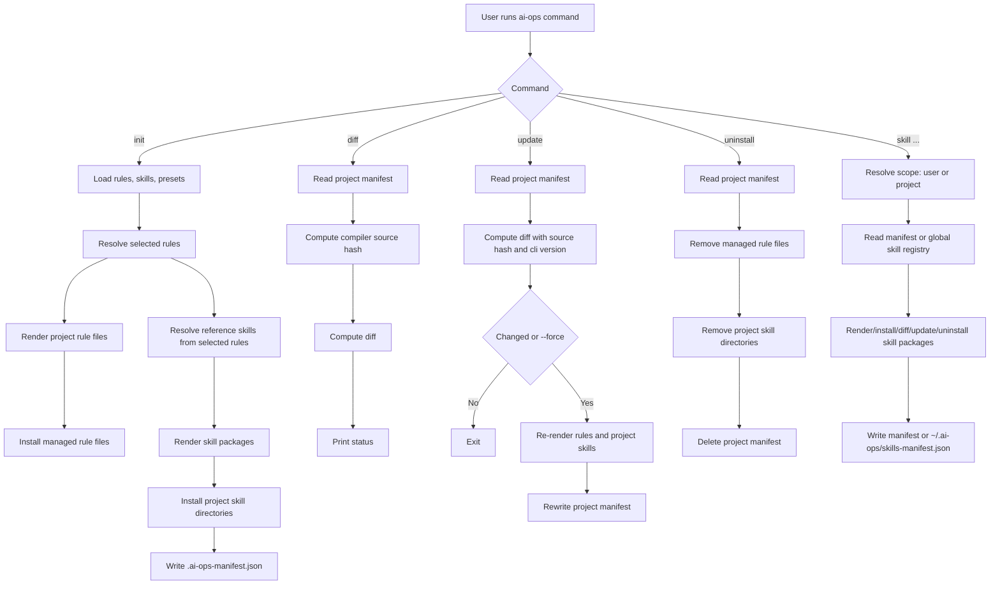
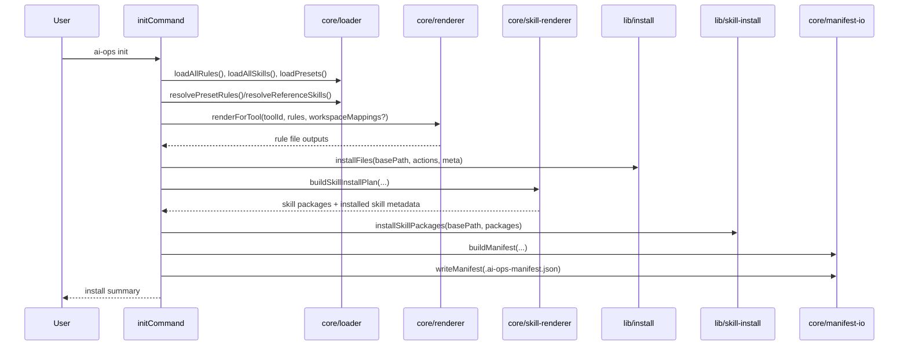
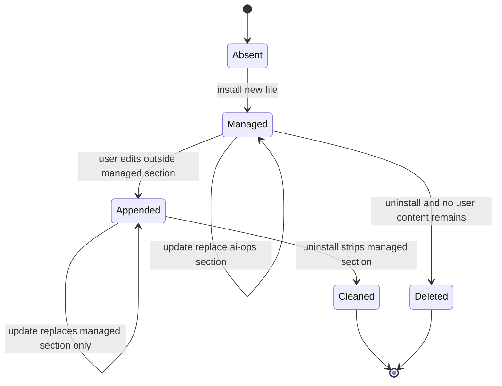
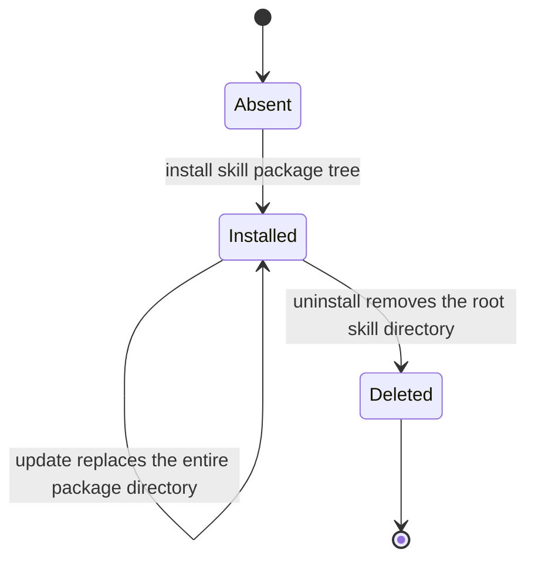

# ai-ops-cli Master Blueprint

> 핵심 컨셉
>
> 플랫폼별 규칙 파일과 skill 패키지를 직접 손으로 관리하지 않고, `rules + skills + presets` 메타데이터를 SSOT로 관리해 다중 AI 환경에 동일한 정책을 배포한다.

## 1. 문제 정의

Claude Code, Codex, Gemini CLI는 규칙 파일 경로와 skill 로딩 경로가 다르다. 수동 관리 시 다음 문제가 반복된다.

- 도구별 파일 불일치로 인한 설정 드리프트
- 대형 규칙을 항상 로드해 컨텍스트가 비대해지는 문제
- 사용자 파일을 덮어쓰거나 skill 디렉토리를 중복 관리하는 위험

해결 목표는 다음과 같다.

- 단일 SSOT(`apps/cli/data/rules/*.yaml`, `apps/cli/data/skills/*.yaml`, `apps/cli/data/presets.yaml`)에서 도구별 산출물 생성
- project rule 설치와 user/project scope skill 설치를 동시에 지원
- 같은 입력에 대해 같은 산출물을 만드는 결정론적 렌더링 유지
- reference skill로 외부화된 규칙은 코어 instruction 파일에는 요약만 남기고, 상세 내용은 지연 로딩 skill로 분리

## 2. 핵심 설계 원리

- SSOT First: 규칙과 skill은 YAML 메타데이터에서만 정의한다.
- Deterministic Rendering: 파일 로드 순서, rule 정렬, skill 패키지 생성 순서를 결정론적으로 유지한다.
- Functional Core / Imperative Shell: 스키마 검증, 렌더링, hash 계산은 순수 함수에 두고 파일 I/O는 명령 계층에서 수행한다.
- Managed Section Safety: project rule 파일은 `ai-ops` 관리 섹션만 갱신한다.
- Dedicated Skill Package Safety: skill은 전용 디렉토리 단위로 설치/교체/삭제한다.
- Split State Tracking: project 상태와 user/global skill 상태를 별도 저장소로 추적한다.

## 3. 아키텍처 개요

### 3.1 고수준 구조

- Runtime package: `apps/cli`
- Core compiler/runtime logic: `apps/cli/src/core`
- Commands: `apps/cli/src/commands`
- File install/uninstall/settings helpers: `apps/cli/src/lib`
- SSOT data: `apps/cli/data`

### 3.2 제어 흐름

### 3.3 `init` 내부 상호작용

## 4. 데이터/인터페이스 계약

### 4.1 Rule Schema

`apps/cli/src/core/schemas/rule.schema.ts` 기준:

- `id`: kebab-case
- `category`: string
- `tags`: string[]
- `priority`: 0~100 int
- `delivery`: `"core" | "reference-skill"` (default: `core`)
- `reference_skill_id?`: reference skill과 연결되는 skill id
- `core_excerpt?`: 코어 instruction 파일에 남길 최소 요약 bullet
- `supported_tools`: 지원 도구 목록
- `content.constraints`: string[]
- `content.guidelines`: string[]
- `content.decision_table?`: `{ when, then, avoid? }[]`

설계 규칙:

- `delivery = "reference-skill"`인 rule은 코어 문서에서 `core_excerpt`만 렌더링한다.
- 상세 규칙 본문은 연결된 reference skill의 `references/source-rules.md`로 이동한다.

### 4.2 Skill Schema

`apps/cli/src/core/schemas/skill.schema.ts` 기준:

- `id`
- `kind: "reference" | "task"`
- `description`
- `supported_tools`
- `allow_implicit_invocation`
- `install_scopes: ("project" | "user")[]`
- `instructions?`
- `source_rules?`
- `references?`, `assets?`, `scripts?`: `{ path, content }[]`

추가 규칙:

- `reference` skill은 `source_rules`를 기반으로 `references/source-rules.md`를 생성한다.
- `task` skill은 선택적으로 `scripts/`, `references/`, `assets/`를 가진다.
- Codex/Gemini는 `.agents/skills`를 공유하므로 같은 skill은 공통 패키지 하나로 설치된다.

### 4.3 Preset Schema

- `id`, `description`, `rules[]`
- `PRESET_RULE_BUNDLES`로 logical rule을 실제 rule 묶음으로 확장한다.
- 현재 번들 예시: `graphql -> graphql-core + client/server variant`

### 4.4 Tool Output Contract

| Tool ID       | Project Rules Output                               | Skill Output                    |
| ------------- | -------------------------------------------------- | ------------------------------- |
| `claude-code` | `.claude/rules/<rule>.md`, `<workspace>/CLAUDE.md` | `.claude/skills/<skill-id>/`    |
| `codex`       | `AGENTS.md`, `<workspace>/AGENTS.override.md`      | `.agents/skills/<skill-id>/`    |
| `gemini`      | `GEMINI.md`, `<workspace>/GEMINI.md`               | `.agents/skills/<skill-id>/`    |

추가 규칙:

- Claude는 domain rule에서 `paths` frontmatter를 사용한다(매핑 존재 시).
- Codex root `AGENTS.md`에는 Plan Snapshot 섹션이 항상 append된다.
- skill 패키지는 항상 `SKILL.md`를 포함하고, 필요 시 `references/`, `assets/`, `scripts/`를 추가한다.

### 4.5 Project Manifest Contract

파일명: `.ai-ops-manifest.json` (project root)

핵심 필드:

- `tools: string[]`
- `scope: "project"`
- `preset?: string`
- `workspaces?: Record<string, { preset: string; rules: string[] }>`
- `installed_rules: string[]`
- `installed_files?: string[]`
- `installed_skills?: { id, kind, tools, scope, installed_paths, sourceHash, source_rules? }[]`
- `appended_files?: string[]`
- `settings?: { claude?: string[]; gemini?: string[]; prettierignore?: boolean }`
- `cliVersion?: string`
- `sourceHash: string` (compiler data 전체 기준 6-char lowercase hex)
- `generatedAt: ISO 8601 UTC`

용도:

- project rule 설치 상태 추적
- project scope skill 설치 상태 추적
- `diff/update/uninstall` 기준점

### 4.6 Global Skill Registry Contract

파일명: `~/.ai-ops/skills-manifest.json`

핵심 필드:

- `skills: InstalledSkill[]`
- `cliVersion?: string`
- `generatedAt: ISO 8601 UTC`

용도:

- user/global scope skill 설치 상태 추적
- `ai-ops skill list/diff/update/uninstall`의 user scope 기준점

## 5. 명령별 기능 사양

### 5.1 `ai-ops init`

사용자 입력:

- 도구 선택(복수)
- 모노레포 여부
- 워크스페이스 선택(모노레포)
- 워크스페이스별 preset 선택
- domain rule 그룹 해제 선택(global 그룹은 잠금)
- 옵션 설정 설치(Claude/Gemini settings, `.prettierignore`)

실행 알고리즘:

1. rules/skills/presets 로드 및 compiler `sourceHash` 계산
2. 선택된 rules를 tool별 project rule 파일로 렌더링
3. 선택된 rules에서 reference skills를 추론
4. project scope skill 패키지를 도구별 경로에 설치
5. project manifest 생성/저장

### 5.2 `ai-ops diff`

1. project manifest 로드 (없으면 종료 코드 1)
2. 현재 compiler `sourceHash` 계산
3. `computeDiff` 실행
4. `up-to-date` 또는 변경 정보 출력

주의:

- 비교 대상 rule 집합은 `manifest.installed_rules`
- source hash는 rules만이 아니라 `rules + skills + presets` 전체 기준

### 5.3 `ai-ops update [--force]`

1. project manifest 로드
2. `computeDiff`로 변경 여부 판단(`sourceHash`, `cliVersion`, rules diff)
3. 변경 없음 + `--force` 미사용이면 종료
4. `manifest.installed_rules` 기준으로 project rule 파일 재설치
5. `manifest.installed_skills` 기준으로 project skill 패키지 재설치
6. project manifest 재기록
7. settings가 있으면 Claude/Gemini settings 재적용

### 5.4 `ai-ops uninstall`

1. project manifest 로드
2. 삭제 대상 rule 파일 계산
3. 삭제 대상 project skill 디렉토리 계산
4. 사용자 확인
5. managed section clean/delete 수행
6. project skill 디렉토리 삭제
7. 빈 디렉토리 정리
8. project manifest 삭제

### 5.5 `ai-ops skill list`

- 기본 scope는 `user`
- `--project` 또는 `--scope project`로 project scope 조회 가능
- 설치 여부를 scope별 state 저장소와 대조해 표시

### 5.6 `ai-ops skill install <skill-id>`

- 기본 scope는 `user`
- `-g`는 user scope alias
- `--project` 또는 `--scope project`로 project scope 설치 가능
- `--tool <tool...>`이 없으면 해당 skill의 `supported_tools` 전체를 사용
- 설치 후 user scope면 global registry, project scope면 project manifest 갱신

### 5.7 `ai-ops skill diff [skill-id]`

- scope별 저장소에서 설치된 skill을 읽음
- 현재 SSOT 기준으로 다시 렌더링했을 때의 `sourceHash`와 설치 시점 hash를 비교
- `skill-id`가 없으면 해당 scope의 설치된 skill 전체 비교

### 5.8 `ai-ops skill update [skill-id]`

- scope별 저장소에서 설치된 skill을 읽음
- 현재 SSOT 기준으로 skill 패키지 재설치
- 완료 후 해당 scope 저장소를 새 hash로 갱신

### 5.9 `ai-ops skill uninstall <skill-id>`

- scope별 저장소에서 설치된 skill을 읽음
- skill 루트 디렉토리 제거
- 저장소에서 해당 entry 제거
- project scope에서 manifest가 비면 manifest 파일도 제거

## 6. 파일 상태 전이 규칙

### 6.1 Project Rule Files

판별 규칙:

- `hasAiOpsSection(content)`이면 managed 처리
- `hasLegacyHeader(content)`이면 legacy managed로 간주
- 둘 다 아니면 non-managed(사용자 파일)로 간주

### 6.2 Skill Package Directories

판별 규칙:

- skill은 전용 루트 디렉토리 단위로 관리한다.
- 업데이트는 루트 디렉토리를 비우고 현재 패키지 트리로 재작성한다.

## 7. 비기능 요구사항

- Node.js >= 18
- ESM 기반 TypeScript (`type: module`)
- project 명령은 항상 `process.cwd()` 기준
- user scope skill 명령은 `AI_OPS_HOME ?? HOME` 기준
- 파일/registry/manifest 생성 시 UTC ISO timestamp 사용

## 8. 테스트 전략 및 수용 기준

### 8.1 단위 테스트

- schema parse 실패/성공 케이스
- loader 정렬/해석 규칙
- core renderer와 skill renderer 경로/출력
- managed section 파싱/교체/제거
- manifest/registry I/O
- diff/sourceHash 계산

### 8.2 통합/E2E

- 단일 프로젝트 설치/재설치(idempotency)
- non-managed 파일 append 보존
- project uninstall 시 section clean vs file delete 분기
- subprocess로 `skill install` project/user scope 검증
- `AI_OPS_HOME`을 사용한 user scope 검증

### 8.3 수용 기준

- 동일 입력 데이터로 동일 파일 경로/콘텐츠 생성
- reference skill로 외부화된 rule은 코어 문서에 요약만 남는다
- 사용자 작성 본문이 project `update/uninstall`로 파손되지 않음
- project 상태는 manifest, user skill 상태는 global registry로 재현 가능
- Codex/Gemini 공유 `.agents/skills`와 Claude `.claude/skills` 배치가 정확함

## 9. 재구현 체크리스트

1. 스키마(`Rule`, `Skill`, `Manifest`, `SkillRegistry`)를 Zod로 고정
2. loader 구현(결정론적 파일 로드 + preset bundle 확장 + reference skill 해석)
3. core renderer 구현(도구별 규칙 경로 전략 + excerpt 렌더링)
4. skill renderer 구현(도구별 skill 경로 전략 + package tree 생성)
5. managed section 유틸 구현(append/replace/strip)
6. project file install/uninstall + skill package install/uninstall 구현
7. 명령(`init`, `diff`, `update`, `uninstall`, `skill ...`) 오케스트레이션 구현
8. 테스트 매트릭스 통과
9. README 문서와 CLI 표면 동기화

## 10. 관련 문서

- 사용자/패키지 문서: `README.md`, `apps/cli/README.md`
- 구현/운영 플레이북: `docs/implementation-playbook.md`
- 참고 자료: `docs/references/*`
