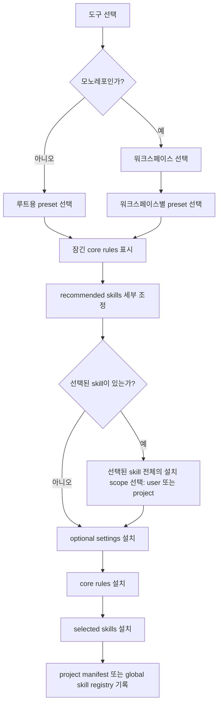

# ai-ops-cli 계획

## 배경

Claude Code, Codex, Gemini CLI는 모두 instruction 파일 구조와 skill 설치 경로가 다르다. 팀이나 개인이 여러 프로젝트를 바이브코딩하는 환경에서는 같은 규칙과 skill을 여러 도구에 반복 배포해야 하고, 이 상태를 수동으로 맞추면 쉽게 드리프트가 난다.

또한 모든 규칙을 항상 로드하는 방식은 컨텍스트 비용이 크다. 특히 stack/framework/library 가이드는 프로젝트에 따라 필요 여부가 달라지므로, general rule과 lazy-loaded skill을 같은 방식으로 관리하면 유지보수 비용과 컨텍스트 낭비가 동시에 커진다.

## 문제 정의

현재 해결해야 하는 문제는 세 가지다.

- 도구마다 출력 경로와 로딩 모델이 달라 같은 정책을 여러 번 관리하게 된다.
- general core rule과 stack-specific guidance가 같은 계층에 섞이면 항상 로드 비용이 커지고, rule과 skill 사이에 중복 SSOT가 생기기 쉽다.
- project-local 설치와 user/global 설치를 함께 지원해야 하는데, 상태 추적과 uninstall/update 경계가 섞이면 운영 실수가 발생한다.

## 솔루션

해법은 source of truth를 명확히 둘로 나누는 것이다.

- 항상 로드해도 되는 general rule만 `apps/cli/data/rules/*.yaml`에 남긴다.
- stack/framework/library/domain guidance는 `apps/cli/data/skills/<skill-id>/` 디렉토리를 SSOT로 관리한다.
- preset은 core rules와 recommended skills를 직접 참조한다.
- CLI는 이 SSOT를 읽어 Claude/Codex/Gemini용 산출물로 렌더링하고, project manifest와 global skill registry를 분리해서 상태를 관리한다.

## 요약

`ai-ops-cli`는 두 종류의 source of truth를 관리한다.

- `apps/cli/data/rules/*.yaml`: 항상 로드되는 core rule만 보관
- `apps/cli/data/skills/<skill-id>/`: 지연 로딩 가능한 설치형 skill 보관

CLI는 이 소스를 읽어 Claude Code, Codex, Gemini CLI용 산출물로 변환하고, project 상태와 user-scope skill 상태를 분리 추적한다.

## 현재 SSOT 경계

### Core Rules

YAML에는 general rule만 남긴다.

- `role-persona`
- `communication`
- `code-philosophy`
- `naming-convention`
- `plan-mode`

이 규칙들은 짧고, stack과 무관하며, 기본 협업 스타일을 정하기 때문에 항상 로드해도 안전하다.

### Skills

stack/framework/library/domain별 가이드는 모두 `apps/cli/data/skills/` 아래에 둔다.

예시:

- `backend-service-standards`
- `typescript-language`
- `python-language`
- `frontend-web-react-next-runtime`
- `backend-ts-nestjs-runtime`
- `graphql-contract`
- `graphql-client-integration`

`reference skill` 규약:

- `SKILL.md`: 얇은 진입 문서
- `references/reference.md`: 상세 내용의 canonical source

`task skill` 규약:

- `SKILL.md`: 절차의 canonical source

CLI는 skill 디렉토리 전체를 그대로 복사한다. skill 본문을 따로 생성하지 않는다.

## Preset 모델

`apps/cli/data/presets.yaml`은 이제 core rules와 recommended skills를 직접 참조한다.

```yaml
frontend-web:
  description: 웹 프론트엔드 프로젝트를 위한 프리셋
  rules:
    - role-persona
    - communication
    - code-philosophy
    - naming-convention
    - plan-mode
  skills:
    - typescript-language
    - frontend-web-react-next-runtime
    - frontend-web-shadcn-ui
```

`reference_skill_id`, bundle expansion, `source_rules` 같은 rule-to-skill 간접 연결은 더 이상 사용하지 않는다.

## 도구별 출력 계약

| 도구        | Core rule 출력                                        | Skill 출력                   |
| ----------- | ----------------------------------------------------- | ---------------------------- |
| Claude Code | `.claude/rules/<rule-id>.md`, `<workspace>/CLAUDE.md` | `.claude/skills/<skill-id>/` |
| Codex       | `AGENTS.md`, `<workspace>/AGENTS.override.md`         | `.agents/skills/<skill-id>/` |
| Gemini CLI  | `GEMINI.md`, `<workspace>/GEMINI.md`                  | `.agents/skills/<skill-id>/` |

추가 규칙:

- Claude는 필요한 경우 domain rule에 `paths` frontmatter를 사용한다.
- Codex와 Gemini는 `.agents/skills`를 공유한다.
- `agents/openai.yaml` 같은 tool-specific metadata는 source skill 디렉토리의 내용을 그대로 복사한다.

## 상태 추적

### Project Manifest

파일: `.ai-ops-manifest.json`

추적 대상:

- 선택된 도구
- project scope core rule 설치 상태
- project scope skill 설치 상태
- workspace별 preset/rule 선택
- append된 파일과 optional settings
- compiler `sourceHash`와 CLI 버전

### Global Skill Registry

파일: `~/.ai-ops/skills-manifest.json`

추적 대상:

- user-scope 설치 skill
- 설치 경로
- skill source hash
- CLI 버전과 생성 시각

project 명령은 user-scope skill을 삭제하지 않는다.

## Init UX

`ai-ops init`은 preset-first 흐름을 따른다.



Scope 규칙:

- 기본 skill scope는 `user`
- `init` 1회 실행에서 선택된 skills는 하나의 공통 scope를 공유한다
- `user` scope는 global skill registry만 갱신한다
- `project` scope는 `.ai-ops-manifest.json`에 installed skill metadata를 기록한다

## Skill 명령

`ai-ops skill ...`은 skill 자체를 직접 관리한다.

- `ai-ops skill install <skill-id>`
- `ai-ops skill list`
- `ai-ops skill diff`
- `ai-ops skill update`
- `ai-ops skill uninstall <skill-id>`

동작 규칙:

- 기본 scope는 `user`
- `--project`를 주면 현재 repo에 설치한다
- source skill 디렉토리를 재귀적으로 복사한다
- 지원하지 않는 tool/scope 조합은 명시적으로 실패한다

## Update / Diff / Uninstall

### `ai-ops diff`

- 현재 compiler 상태를 `.ai-ops-manifest.json`과 비교한다
- 저장된 preset/workspace 선택으로부터 현재 core rules를 다시 계산한다
- project-installed skills의 드리프트를 함께 보고한다

### `ai-ops update`

- preset/workspace 선택을 기준으로 현재 core rules를 다시 계산한다
- project-installed skills를 다시 설치한다
- 현재 rule id와 project skill metadata로 manifest를 다시 쓴다

### `ai-ops uninstall`

- project-managed rule 파일을 제거한다
- project-installed skill 디렉토리를 제거한다
- user-scope skill은 건드리지 않는다

## Legacy 마이그레이션 규칙

오래된 manifest에는 `typescript`, `nextjs`, `graphql-client-web` 같은 과거 stack/framework rule id가 남아 있을 수 있다.

현재 동작:

- `diff`와 `update`는 이런 legacy externalized rule id를 현재 skill catalog로 매핑한다
- 마이그레이션된 항목은 project-installed skill로 취급한다
- 다시 쓰인 manifest에는 현재 core rule id와 명시적인 `installed_skills`만 남긴다

이 방식으로 externalized guidance를 YAML과 skill 양쪽에 중복 저장하지 않으면서도 업그레이드 경로를 유지한다.
