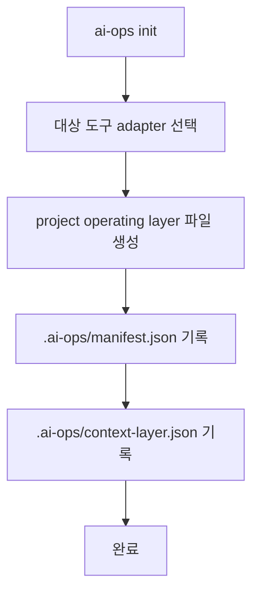

# ai-ops operating layer and integrations master blueprint

## 요약

`ai-ops`는 프로젝트/에이전트 작업에 필요한 operating layer와 global runtime integration을 설치하고 관리하는 bash CLI다. 프로젝트에는 에이전트가 항상 읽어야 하는 운영 문서와 상태 인덱스를 두고, 재사용 가능한 runtime 기능은 사용자 환경의 integration으로 설치한다.

이 문서는 다음 major breaking release의 기준 계약이다. 현재 repo 구현은 project operating layer, optional packs, 그리고 integration을 이루는 low-level component 명령(skill, subagent, Codex hook, user-local receipt)을 기준으로 동작한다. old rules + skills scaffolder 모델은 deprecated 문맥으로만 남긴다.

```text
Project repo
  AGENTS.md
  GEMINI.md / CLAUDE.md
  docs/agent/*
  docs/business/*
  docs/docs-status.md
  docs/specs/*        # optional pack
  .ai-ops/manifest.json
  .ai-ops/context-layer.json

User/global runtime
  integrations/*
    components:
      skills/*
      subagents/*
      hooks/*
      receipts/config/*
```

## 제품 정의

`ai-ops`의 책임은 프로젝트마다 흩어지는 에이전트 운영 지식과 runtime 연결을 한곳에서 설치하고, drift를 감지하고, 안전하게 갱신하는 것이다.

- project scope: agent operating layer 문서와 `.ai-ops/*` 상태 파일
- integration scope: agent runtime workflow를 제공하는 user/global 설치 단위
- component scope: integration을 이루는 skill, subagent, Codex hook, hook runner, user-local receipt/config
- adapter scope: `GEMINI.md`, `CLAUDE.md`처럼 도구가 요구하는 얇은 진입 파일

이 경계를 통해 프로젝트별 지식은 repository에 남기고, 재사용 가능한 실행 능력과 hook 기반 workflow는 사용자 환경에 둔다.

## 설치 대상

### Project operating layer

기본 설치 대상:

- `AGENTS.md`
- `GEMINI.md`
- `CLAUDE.md`
- `docs/agent/rules/00-agent-baseline.md`
- `docs/agent/workflow.md`
- `docs/agent/terminology.md`
- `docs/agent/rules/routing-rules.md`
- `docs/agent/rules/doc-update-rules.md`
- `docs/agent/rules/stop-rules.md`
- `docs/agent/checks/impact-checklist.md`
- `docs/agent/maps/codebase-map.md`
- `docs/business/terminology.md`
- `docs/business/business-rules.md`
- `docs/docs-status.md`
- `.ai-ops/manifest.json`
- `.ai-ops/context-layer.json`

`AGENTS.md`는 canonical entrypoint다. `GEMINI.md`와 `CLAUDE.md`는 각 도구가 읽을 수 있도록 `AGENTS.md`를 우선 기준으로 삼으라는 adapter 역할만 한다. 중복된 canonical 문서를 피하기 위해 `docs/agent/AGENTS.md`는 만들지 않는다.

### Optional packs

`docs/specs/`는 optional pack 위치로 고정한다. spec lifecycle이 필요한 프로젝트만 설치한다. 프로젝트 용어의 source of truth는 optional pack 내부가 아니라 base operating layer의 `docs/business/terminology.md`다.

Deprecated old model:

- root `specs/`는 더 이상 새 모델의 설치 위치가 아니다.
- 기존 `ai-ops spec init`의 root `specs/` scaffolding은 `ai-ops pack install spec-lifecycle`로 대체한다.
- `apps/cli/data/rules/*.yaml`와 `apps/cli/data/presets.yaml`은 새 모델의 설치 원천이 아니다. baseline rule은 `docs/agent/rules/00-agent-baseline.md`가 canonical source다.

### ai-ops integrations

Integration은 사용자가 설치하고 싶은 agent runtime 기능 단위다. 하나의 integration은 다음 component를 묶을 수 있다.

- reference skills
- task skills
- subagents
- Codex hooks
- hook runners
- user-local receipts/config

Component는 프로젝트 운영 문서가 아니다. CLI는 각 도구의 global 또는 user-level discovery 규칙에 맞춰 설치하고, project manifest에는 기록하지 않는다.

Integration catalog source는 `apps/cli/data/integrations/integration-registry.json`이다. Catalog는 integration id, 설명, 그리고 component list를 선언한다. v1 component model은 `skill`, `codex-hook`, `receipt-config`를 명시하고, 실제 설치 소유권은 별도 user/global manifest에 기록한다.

현재 구현은 `ai-ops integration ...` 상위 명령을 제공한다. `skill`, `subagent`, `codex-hook`, `context-promotion` 같은 low-level component 명령은 디버그와 개별 component 관리 용도로 유지한다.

현재 integration:

- `context-promotion`: `context-promotion-review` Codex skill, shared Codex `PostToolUse` hook workflow, user-local receipt를 묶어 git commit 이후 운영 지식 승격 검토를 돕는다.
- `pc`: `pc` Codex skill과 같은 shared Codex `PostToolUse` hook runner를 묶어 성공적인 `git commit` 직후 `$pc:done` handoff 누락을 방지한다. hook은 `~/.personal-project-contexts/`에 matching workspace, active workstream, current repo scope가 준비된 경우에만 prompt를 내며, handoff 반영은 `ai-ops pc done draft` -> AI draft 작성 -> `ai-ops pc done apply` 순서로 처리한다.

Integration 설치 소유권은 user/global runtime home의 `.ai-ops/integrations-manifest.json`에 기록한다. Uninstall은 integration이 소유한 component만 제거하고 기존 수동 설치는 보존한다.

## 문서 신뢰도 모델

operating layer 문서는 frontmatter와 `docs/docs-status.md`로 신뢰도를 관리한다.

공통 frontmatter:

```yaml
status: Active
layer: agent
owner: ai-ops
read_when:
  - before_task
update_when:
  - workflow_changes
```

기본 상태:

| 상태       | 의미                                         | 기본 적용 문서                      |
| ---------- | -------------------------------------------- | ----------------------------------- |
| `Active`   | 에이전트가 판단 근거로 사용할 수 있음        | workflow, rules, impact checklist   |
| `Reserved` | 자리만 만들었고 근거로 쓰면 안 됨            | codebase-map, business-rules, specs |
| `Draft`    | 작성 중이며 사용 전 검토가 필요함            | 프로젝트가 직접 작성 중인 확장 문서 |
| `Archived` | 과거 기록이며 현재 운영 판단에 사용하지 않음 | deprecated 문서                     |

`Reserved` 문서는 비어 있거나 프로젝트별 보강 전 상태일 수 있다. 에이전트는 `Reserved` 문서를 현재 사실로 인용하지 않는다.

## 도구별 entrypoint 계약

| 도구        | entrypoint  | 역할                                           |
| ----------- | ----------- | ---------------------------------------------- |
| Codex       | `AGENTS.md` | canonical operating layer entrypoint           |
| Gemini CLI  | `GEMINI.md` | `AGENTS.md`를 기준으로 읽도록 안내하는 adapter |
| Claude Code | `CLAUDE.md` | `AGENTS.md`를 기준으로 읽도록 안내하는 adapter |

도구별 adapter에는 중복 운영 규칙을 넣지 않는다. adapter가 길어지는 경우 canonical 문서를 분리한 것이 아니라 중복을 만든 신호로 본다.

## 상태 파일

### `.ai-ops/manifest.json`

project operating layer 설치 상태를 기록한다.

추적 대상:

- 설치된 CLI 버전
- 선택된 도구 adapter
- 설치된 project layer 파일 목록
- 각 파일의 source hash
- optional pack 설치 여부
- 생성/갱신 시각

### `.ai-ops/context-layer.json`

에이전트가 문서 계층을 빠르게 탐색할 수 있는 index다.

추적 대상:

- 문서 경로
- frontmatter 상태
- layer
- read/update 조건
- content hash

`audit` 명령은 `manifest.json`, `context-layer.json`, 실제 파일, `docs/docs-status.md`의 불일치를 읽기 전용으로 검사한다.

## Scope 정책

새 모델은 scope를 단순화한다.

- project scope는 operating layer 문서만 관리한다.
- integration scope는 user/global runtime 기능만 관리한다.
- skills, subagents, hooks, receipts/config는 integration component로 취급한다.
- `skill` 명령은 project-local 설치 옵션을 제공하지 않는다.
- `skill` 명령에서 `--project`, `--global`, `--scope` 공개 옵션은 제거한다.
- `--tool`은 유지한다. 각 도구의 component discovery 위치가 다르기 때문이다.

Deprecated old model:

- `--project` skill 설치는 제거 대상이다.
- `--global`과 `--scope`로 skill scope를 직접 지정하는 모델은 제거 대상이다.
- project scope skill 설치와 project-installed skill manifest 추적은 제거 대상이다.
- old `.ai-ops-manifest.json`는 새 `.ai-ops/manifest.json`로 대체한다.
- legacy manifest migration은 제공하지 않는다.

## Breaking policy

이번 전환은 breaking release다. 기존 프로젝트 자동 마이그레이션은 만들지 않는다.

기존 사용자는 다음 절차를 따른다.

1. old CLI로 `ai-ops uninstall`을 실행한다.
2. 새 major CLI를 설치한다.
3. 새 모델로 `ai-ops init`을 다시 실행한다.
4. 필요한 경우 optional `docs/specs/` pack을 설치한다.

이 정책은 복잡한 partial migration보다 운영 계층의 신뢰도를 우선한다. old manifest와 새 context-layer가 한 프로젝트에서 섞이면 에이전트가 stale 계약을 사실로 읽을 수 있기 때문이다.

## 명령 목표 계약

### `ai-ops init`

project operating layer를 설치한다.



현재 `ai-ops init`은 monorepo root를 하나의 project로 설치할 수 있다. package/workspace별 adapter나 override 파일을 생성/관리하는 기능은 아직 제공하지 않으며, workspace별 operating layer override는 후속 개선으로 둔다.

### `ai-ops diff`

현재 파일과 `.ai-ops/manifest.json`, `.ai-ops/context-layer.json`의 drift를 비교한다.

### `ai-ops update`

project operating layer를 현재 CLI 템플릿 기준으로 재적용한다. 사용자 작성 영역이 있는 문서는 보존 규칙을 명확히 둔다.

### `ai-ops audit`

frontmatter, `docs/docs-status.md`, manifest, context-layer index의 불일치를 읽기 전용으로 검사한다.

### `ai-ops uninstall`

project operating layer와 `.ai-ops/*` project state만 제거한다. user/global integrations와 그 component는 제거하지 않는다.

### `ai-ops skill ...`

integration component인 skill lifecycle만 관리한다. 현재 구현의 low-level 명령이며, 후속 `integration` 상위 UX가 도입되어도 디버그/개별 설치 용도로 남길 수 있다.

### `ai-ops subagent ...`

integration component인 subagent lifecycle만 관리한다. Phase 3에서 도입했다.

### `ai-ops context-promotion ...`

`context-promotion` integration이 사용하는 user-local promotion review receipt를 관리한다. receipt는 source of truth가 아니며 프로젝트 repo의 `.ai-ops/*`에는 기록하지 않는다.

### `ai-ops codex-hook ...`

Codex 전용 opt-in hook component를 설치, 조회, 제거한다. hook은 npm global `ai-ops integration hook post-tool-use --workflows ...` dispatcher command를 user-level `PostToolUse`에 저장한다. `context-promotion` workflow는 `git commit` 이후 `context-promotion-review` skill 사용을 안내하고, `pc` workflow와 함께 설치되면 하나의 handler에서 continuation output을 병합한다. 설치 시 Codex skill도 user/global runtime 위치에 보장 설치한다. 작업 커밋은 막지 않고, non-managed hook 실행 여부는 Codex `/hooks` review/trust가 authoritative 하다.

### `ai-ops integration ...`

Integration 단위로 관련 component를 함께 설치, 조회, 제거한다.

```bash
ai-ops integration list
ai-ops integration install context-promotion
ai-ops integration install pc
ai-ops integration status pc
ai-ops integration uninstall pc
```

현재 v1은 `context-promotion`과 `pc`를 지원한다. Integration manifest는 user/global runtime home의 `.ai-ops/integrations-manifest.json`이며 project operating layer uninstall 대상이 아니다.

### `ai-ops pc ...`

`pc` integration의 handoff workflow를 CLI로 실행한다.

```bash
ai-ops pc status
ai-ops pc done draft --cwd /path/to/product-repo
ai-ops pc done apply --draft /path/to/draft.json
```

CLI는 LLM을 호출하지 않는다. Codex가 draft JSON의 AI 작성 필드를 채우고, `apply`가 schema/path/status/HEAD를 검증한 뒤 `~/.personal-project-contexts/`의 허용 context 파일만 갱신하고 context repo에서만 commit한다.

## Deprecated old model

다음 모델은 문서와 코드에서 단계적으로 제거한다.

- `rules + skills scaffolder`를 제품 정의로 설명하는 문구
- preset-first init UX
- project scope skill 설치
- `ai-ops skill install --project`
- project-installed skill directory 추적
- `.ai-ops-manifest.json`
- legacy externalized rule migration
- root `specs/`

위 항목은 새 operating layer 계약 밖에 있는 historical/deprecated 모델로만 남긴다.
