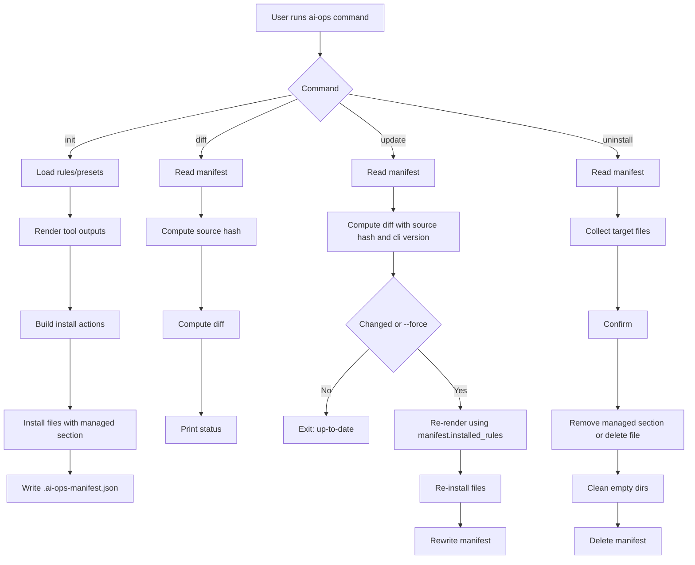
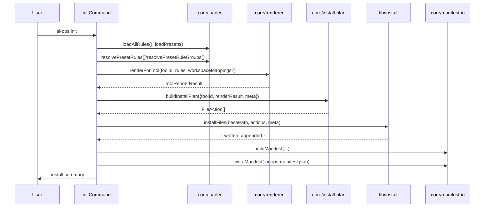
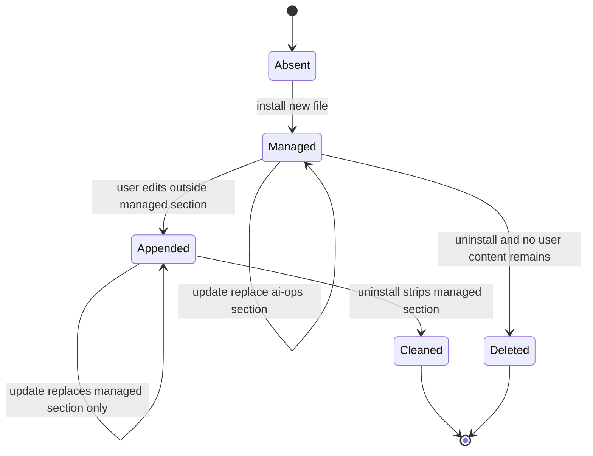

# ai-ops-cli Master Blueprint

> **📌 핵심 컨셉**
>
> 플랫폼 종속적인 파일을 직접 관리하지 않고, **추상화된 메타데이터**를 SSOT로 관리하여 다중 AI 환경에 대응하는 **Asset Centralization(자산 중앙화)** 달성.

## 1. 문제 정의

서로 다른 AI 도구(Claude Code, Codex, Gemini CLI)는 규칙 파일 위치와 컨텍스트 로딩 방식이 다르다.
수동 관리 시 다음 문제가 반복된다.

- 도구별 파일 불일치로 인한 설정 드리프트
- 팀 규칙 업데이트 시 동기화 비용 증가
- 사용자 작성 파일을 덮어쓰는 위험

해결 목표는 다음과 같다.

- 단일 SSOT(`apps/cli/data/rules/*.yaml`, `apps/cli/data/presets.yaml`)에서 도구별 산출물 생성
- project-only 범위에서 안전한 설치/업데이트/삭제
- idempotent 실행(같은 명령 반복 실행 안전)

## 2. 핵심 설계 원리

- SSOT First: 규칙은 YAML로만 관리하고 런타임은 렌더링/설치에 집중한다.
- Deterministic Rendering: 파일 로드 순서와 규칙 정렬을 결정론적으로 유지한다.
- Functional Core / Imperative Shell: 스키마 검증/렌더링은 순수 함수, 파일 I/O는 명령 계층에서 처리한다.
- Managed Section Safety: 사용자 파일은 보존하고 `ai-ops` 관리 섹션만 갱신한다.
- Manifest-Driven Lifecycle: 설치 상태는 `.ai-ops-manifest.json`으로 추적하고 `diff/update/uninstall`은 이를 기준으로 동작한다.

## 3. 아키텍처 개요

### 3.1 고수준 구조

- Runtime package: `apps/cli`
- Core compiler/runtime logic: `apps/cli/src/core`
- Commands: `apps/cli/src/commands`
- File install/uninstall/settings helpers: `apps/cli/src/lib`
- SSOT data: `apps/cli/data`

### 3.2 제어 흐름

### 3.3 init 내부 상호작용

## 4. 데이터/인터페이스 계약

### 4.1 Rule Schema (입력 SSOT)

`apps/cli/src/core/schemas/rule.schema.ts` 기준:

- `id`: kebab-case
- `category`: string
- `tags`: string[]
- `priority`: 0~100 int (내림차순 정렬)
- `content.constraints`: string[]
- `content.guidelines`: string[]
- `content.decision_table?`: `{ when, then, avoid? }[]`

### 4.2 Preset Schema

- `id`, `description`, `rules[]`
- 런타임에서 `PRESET_RULE_BUNDLES`로 logical rule을 실제 rule들로 확장한다.
- 현재 번들 예시: `graphql -> graphql-core + (client/server variant)`

### 4.3 Tool Output Contract

| Tool ID       | Single Project                     | Monorepo                                       |
| ------------- | ---------------------------------- | ---------------------------------------------- |
| `claude-code` | `.claude/rules/<rule>.md`          | `.claude/rules/*.md` + `<workspace>/CLAUDE.md` |
| `codex`       | `AGENTS.md` + `AGENTS.override.md` | `AGENTS.md` + `<workspace>/AGENTS.override.md` |
| `gemini`      | `GEMINI.md`                        | `GEMINI.md` + `<workspace>/GEMINI.md`          |

추가 규칙:

- Claude는 domain rule에서 `paths` frontmatter를 사용한다(매핑 존재 시).
- Codex root `AGENTS.md`에는 Plan Snapshot 섹션이 항상 append된다.

### 4.4 Manifest Contract

파일명: `.ai-ops-manifest.json` (project root)

핵심 필드:

- `tools: string[]`
- `scope: "project"`
- `preset?: string`
- `workspaces?: Record<string, { preset: string; rules: string[] }>`
- `installed_rules: string[]`
- `installed_files?: string[]`
- `appended_files?: string[]`
- `settings?: { claude?: string[]; gemini?: string[]; prettierignore?: boolean }`
- `cliVersion?: string`
- `sourceHash: string` (6-char lowercase hex)
- `generatedAt: ISO 8601 UTC`

주의:

- 현재 `buildManifest` 구현은 `settings.prettierignore`를 저장하지 않는다.
- 문서/운영 관점에서는 "현재 코드 동작"을 기준으로 이해한다.

## 5. 명령별 기능 사양

### 5.1 `ai-ops init`

- 사용자 입력:
- 도구 선택(복수)
- 모노레포 여부
- 워크스페이스 선택(모노레포)
- 워크스페이스별 preset 선택
- domain rule 그룹 해제 선택(global 그룹은 잠금)
- 옵션 설정 설치(Claude/Gemini settings, `.prettierignore`)

실행 알고리즘:

1. rules/presets 로드 및 `sourceHash` 계산
2. 선택 결과를 tool별 render 결과로 변환
3. `buildInstallPlan`으로 파일 액션 생성
4. `installFiles`로 파일 작성/섹션 append
5. manifest 생성/저장

### 5.2 `ai-ops diff`

1. manifest 로드 (없으면 종료 코드 1)
2. 현재 `sourceHash` 계산
3. `computeDiff` 실행
4. `up-to-date` 또는 변경 정보 출력

현재 command 구현 특성:

- `currentRules`로 `manifest.installed_rules`를 사용한다.
- 일반 사용 흐름에서는 source hash 변화가 주 판단 기준이다.

### 5.3 `ai-ops update [--force]`

1. manifest 로드
2. `computeDiff`로 변경 여부 판단(`sourceHash`, `cliVersion`, rules diff)
3. 변경 없음 + `--force` 미사용이면 종료
4. manifest의 `installed_rules`(+`workspaces`) 기준으로 재렌더링/재설치
5. manifest 재기록
6. manifest에 설정이 있으면 Claude/Gemini settings 재적용

### 5.4 `ai-ops uninstall`

1. manifest 로드
2. 삭제 대상 계산:

- `installed_files` 우선
- 구 manifest는 `inferInstalledFiles` fallback
- `appended_files` 포함
- settings 경로는 별도 처리

3. 사용자 확인
4. 파일별 삭제/정리 수행
5. 빈 디렉토리 정리
6. manifest 삭제

## 6. 파일 상태 전이 규칙

판별 규칙:

- `hasAiOpsSection(content)`이면 managed 처리
- `hasLegacyHeader(content)`이면 legacy managed로 간주
- 둘 다 아니면 non-managed(사용자 파일)로 간주

## 7. 비기능 요구사항

- Node.js >= 18
- ESM 기반 TypeScript (`type: module`)
- CLI는 항상 `process.cwd()` 기준(project-only)
- 파일/해시 생성 시 UTC ISO timestamp 사용

## 8. 테스트 전략 및 수용 기준

### 8.1 단위 테스트

- schema parse 실패/성공 케이스
- loader 정렬/해석 규칙
- renderer 도구별 경로 생성
- managed section 파싱/교체/제거
- diff/sourceHash 계산

### 8.2 통합/E2E

- 단일 프로젝트 설치/재설치(idempotency)
- non-managed 파일 append 보존
- uninstall 시 section clean vs file delete 분기
- `--scope` 거부 동작

### 8.3 수용 기준

- 동일 입력 데이터로 동일 파일 경로/콘텐츠 생성
- 사용자 작성 본문이 update/uninstall로 파손되지 않음
- manifest 기반으로 `diff/update/uninstall` 재현 가능
- 모노레포에서 workspace 단위 도메인 분리가 정확함

## 9. 재구현 체크리스트

1. 스키마(`Rule`, `Preset`, `Manifest`)를 Zod로 고정
2. loader 구현(결정론적 파일 로드 + preset 번들 확장)
3. renderer 구현(도구별 경로 전략 + global/domain 분리)
4. managed section 유틸 구현(append/replace/strip)
5. install/uninstall 플래너 및 파일 I/O 구현
6. 명령(`init`, `diff`, `update`, `uninstall`) 오케스트레이션 구현
7. 테스트 매트릭스 통과
8. README 문서와 CLI 표면 동기화

## 10. 관련 문서

- 사용자/패키지 문서: `README.md`, `apps/cli/README.md`
- 구현/운영 플레이북: `docs/implementation-playbook.md`
- 참고 자료: `docs/references/*`
