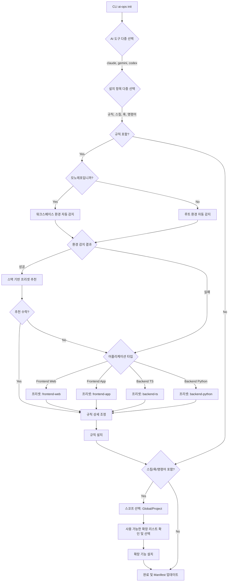

# Objective

Phase 2-C′: `ai-ops init`의 TUI 플로우를 설계하고, 프로젝트 타입별 프리셋을 정의하며, Profile/Manifest 스키마를 새 설계에 맞게 개편합니다.

# Key Files & Context

- `packages/compiler/src/schemas/profile.schema.ts` (삭제 및 `preset.schema.ts`로 교체)
- `packages/compiler/src/schemas/manifest.schema.ts` (변경)
- `packages/compiler/src/schemas/index.ts` (export 변경)
- `packages/compiler/src/schemas/__tests__/profile.schema.test.ts` (삭제 및 `preset.schema.test.ts`로 교체)
- `packages/compiler/src/schemas/__tests__/manifest.schema.test.ts` (변경)
- `packages/compiler/data/presets.yaml` (신규 파일: 프리셋 매핑 정의)

# Implementation Steps

## 1. TUI 플로우 설계 (Mermaid)

피드백 반영 사항:

1. **스코프 선택 지연**: `Rule`은 프로젝트 단위가 일반적이고 `Skill, Hook, Command`는 Global 설정이 될 수 있으므로, 어떤 항목을 설치할지 먼저 선택한 뒤에 필요시 스코프를 묻도록 플로우를 변경했습니다.
2. **모노레포 선행 질문**: 환경 감지를 무작정 하기보다 사용자에게 먼저 모노레포인지 묻고, 그 답변에 따라 Root를 감지할지 Workspace를 감지할지 결정하도록 순서를 변경했습니다.



## 2. 프로젝트 타입 프리셋 매핑 정의 (`data/presets.yaml`)

`packages/compiler/data/presets.yaml` 파일을 생성하여 다음 내용을 정의합니다:

```yaml
frontend-web:
  description: '웹 프론트엔드 프로젝트를 위한 프리셋'
  rules: [general, coding-convention, engineering-standards, typescript, react-ui, nextjs, tech-stack]
frontend-app:
  description: '앱 프론트엔드 프로젝트를 위한 프리셋'
  rules: [general, coding-convention, engineering-standards, flutter, tech-stack]
backend-ts:
  description: 'TypeScript 백엔드 프로젝트를 위한 프리셋'
  rules:
    [
      general,
      coding-convention,
      engineering-standards,
      typescript,
      nestjs,
      prisma-postgresql,
      graphql,
      nestjs-graphql,
      tech-stack,
    ]
backend-python:
  description: 'Python 백엔드 프로젝트를 위한 프리셋'
  rules: [general, coding-convention, engineering-standards, python, fastapi, sqlalchemy, tech-stack]
```

## 3. 스키마 정리 및 교체

1. **Preset 스키마 (`preset.schema.ts`)**
   - `profile.schema.ts` 삭제
   - `preset.schema.ts` 생성: `id`, `description`, `rules` (string array)
2. **Manifest 스키마 업데이트 (`manifest.schema.ts`)**
   - 기존 필드 중 `profile` 제거
   - `tools`: `z.array(z.string().min(1))` (선택한 AI 도구들)
   - `categories`: `z.array(z.enum(['rules', 'skills', 'hooks', 'commands']))`
   - `preset`: `z.string().optional()` (선택한 프리셋 id, 없을 경우 수동 설정)
   - `installed_rules`: `z.array(z.string().min(1))` (`include_rules` 에서 변경)
3. **배럴 파일 업데이트 (`index.ts`)**
   - Profile 관련 export 제거, Preset 관련 export 추가

## 4. 테스트 코드 수정

- `manifest.schema.test.ts`를 새 구조(tools, categories, preset 등)에 맞게 업데이트
- `profile.schema.test.ts`를 삭제하고 `preset.schema.test.ts` 작성

# Verification & Testing

- `npm run test -- packages/compiler/src/schemas` 명령어를 실행하여 Manifest 및 Preset 스키마 테스트가 통과하는지 확인.
- Zod 스키마 구조의 무결성 검증.
