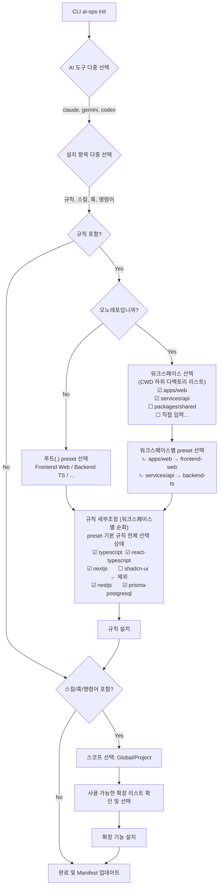

# Objective

Phase 2-C′ ~ Phase 3′: `ai-ops init`의 TUI 플로우를 설계하고, 프로젝트 타입별 프리셋을 정의하며, Profile/Manifest 스키마를 새 설계에 맞게 개편합니다.
Phase 3′에서 도구별 Context Optimization 전략(path-scoped / hierarchical)을 반영하여 모노레포 워크스페이스 디렉토리 선택 플로우가 추가됩니다.

# Key Files & Context

- `packages/compiler/src/schemas/profile.schema.ts` (삭제 및 `preset.schema.ts`로 교체)
- `packages/compiler/src/schemas/manifest.schema.ts` (변경)
- `packages/compiler/src/schemas/index.ts` (export 변경)
- `packages/compiler/src/schemas/__tests__/profile.schema.test.ts` (삭제 및 `preset.schema.test.ts`로 교체)
- `packages/compiler/src/schemas/__tests__/manifest.schema.test.ts` (변경)
- `packages/compiler/data/presets.yaml` (신규 파일: 프리셋 매핑 정의)

# Implementation Steps

## 1. TUI 플로우 설계 (Mermaid)

설계 원칙 (Phase 3′ 확정):

1. **자동 환경 감지 제거**: 환경 감지 및 자동 프리셋 추천 플로우를 제거합니다. 사용자가 항상 워크스페이스와 프리셋을 직접 선택합니다.
2. **워크스페이스 통일**: 모노레포 여부와 도구 종류에 상관없이 동일한 워크스페이스 선택 플로우를 사용합니다. 비모노레포는 루트(`.`)가 자동 선택됩니다.
3. **수동 preset 매핑**: 각 워크스페이스에 preset을 사용자가 직접 선택합니다.
4. **규칙 세부조정**: preset 선택 후, 해당 preset의 규칙이 전체 다중 선택된 상태로 표시됩니다. 사용자는 제외할 규칙을 해제할 수 있습니다.



### 설치 결과 예시 (Phase 5 구현 대상)

**Claude Code (path-scoped)**

```
project/
  .claude/rules/role-persona.md          ← global (frontmatter 없음)
  .claude/rules/typescript.md            ← domain (paths: frontmatter 포함)
  .claude/rules/nextjs.md                ← domain (paths: frontmatter 포함)
```

**Codex (hierarchical)**

```
project/
  AGENTS.md                              ← global 룰 병합
  apps/web/AGENTS.override.md            ← frontend domain 룰
  services/api/AGENTS.override.md        ← backend domain 룰
```

**Gemini (hierarchical)**

```
project/
  GEMINI.md                              ← global 룰 병합
  apps/web/GEMINI.md                     ← frontend domain 룰
  services/api/GEMINI.md                 ← backend domain 룰
```

> **Phase 3 책임**: `renderForTool()`로 global/domain 콘텐츠 분리 렌더링.
> **Phase 5 책임**: TUI 워크스페이스 선택 + 경로별 파일 배치.

## 2. 프로젝트 타입 프리셋 매핑 정의 (`data/presets.yaml`)

`packages/compiler/data/presets.yaml` 파일을 생성하여 다음 내용을 정의합니다:

```yaml
frontend-web:
  description: '웹 프론트엔드 프로젝트를 위한 프리셋'
  rules: [general, coding-convention, engineering-standards, typescript, react-ui, nextjs, tech-stack]
frontend-app:
  description: '앱 프론트엔드 프로젝트를 위한 프리셋'
  rules: [general, coding-convention, engineering-standards, flutter, tech-stack]
backend-ts:
  description: 'TypeScript 백엔드 프로젝트를 위한 프리셋'
  rules:
    [
      general,
      coding-convention,
      engineering-standards,
      typescript,
      nestjs,
      prisma-postgresql,
      graphql,
      nestjs-graphql,
      tech-stack,
    ]
backend-python:
  description: 'Python 백엔드 프로젝트를 위한 프리셋'
  rules: [general, coding-convention, engineering-standards, python, fastapi, sqlalchemy, tech-stack]
```

## 3. 스키마 정리 및 교체

1. **Preset 스키마 (`preset.schema.ts`)**
   - `profile.schema.ts` 삭제
   - `preset.schema.ts` 생성: `id`, `description`, `rules` (string array)
2. **Manifest 스키마 업데이트 (`manifest.schema.ts`)**
   - 기존 필드 중 `profile` 제거
   - `tools`: `z.array(z.string().min(1))` (선택한 AI 도구들)
   - `categories`: `z.array(z.enum(['rules', 'skills', 'hooks', 'commands']))`
   - `preset`: `z.string().optional()` (선택한 프리셋 id, 없을 경우 수동 설정)
   - `installed_rules`: `z.array(z.string().min(1))` (`include_rules` 에서 변경)
3. **배럴 파일 업데이트 (`index.ts`)**
   - Profile 관련 export 제거, Preset 관련 export 추가

## 4. 테스트 코드 수정

- `manifest.schema.test.ts`를 새 구조(tools, categories, preset 등)에 맞게 업데이트
- `profile.schema.test.ts`를 삭제하고 `preset.schema.test.ts` 작성

# Verification & Testing

- `npm run test -- packages/compiler/src/schemas` 명령어를 실행하여 Manifest 및 Preset 스키마 테스트가 통과하는지 확인.
- Zod 스키마 구조의 무결성 검증.
