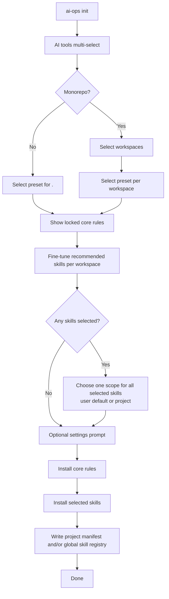

# Historical: old ai-ops init TUI Flow

Deprecated old model: 이 문서는 rules + skills scaffolder 시절의 `ai-ops init` UX 기록이다. 새 agent operating layer 계약의 현재 설계 기준으로 사용하지 않는다.

## Objective

Document the old `ai-ops init` interaction model after the split between core rules and installable skills.

## Flow

```mermaid
flowchart TD
    Start[ai-ops init] --> Tools[AI tools multi-select]
    Tools --> Monorepo{Monorepo?}

    Monorepo -->|No| SinglePreset[Select preset for .]
    Monorepo -->|Yes| Workspaces[Select workspaces]
    Workspaces --> WorkspacePreset[Select preset per workspace]

    SinglePreset --> CoreRules[Show locked core rules]
    WorkspacePreset --> CoreRules

    CoreRules --> SkillTune[Fine-tune recommended skills per workspace]
    SkillTune --> HasSkills{Any skills selected?}
    HasSkills -->|Yes| SkillScope[Choose one scope for all selected skills\nuser default or project]
    HasSkills -->|No| Settings[Optional settings prompt]
    SkillScope --> Settings

    Settings --> InstallRules[Install core rules]
    InstallRules --> InstallSkills[Install selected skills]
    InstallSkills --> Persist[Write project manifest and/or global skill registry]
    Persist --> Done[Done]
```

## Old Model Behavior Notes

- Core rules come from the preset and are not manually fine-tuned in `init`.
- Skills are the only stack-specific items that can be fine-tuned during `init`.
- The skill scope prompt appears only when at least one skill is selected.
- `user` scope is the default and writes to `~/.ai-ops/skills-manifest.json`.
- Old model: `project` scope writes installed skill metadata into `.ai-ops-manifest.json`.
- `ai-ops uninstall` removes only project-managed files.

## Replacement Contract

새 모델의 기준 문서는 [docs/plan.md](./plan.md)이다.

- `AGENTS.md`가 canonical entrypoint다.
- `GEMINI.md`와 `CLAUDE.md`는 adapter다.
- project scope는 operating layer 문서만 관리한다.
- skills/subagents는 global asset으로만 설치한다.
- Deprecated old model: preset-first init UX, project scope skill 설치, `.ai-ops-manifest.json` 추적은 제거 대상이다.
