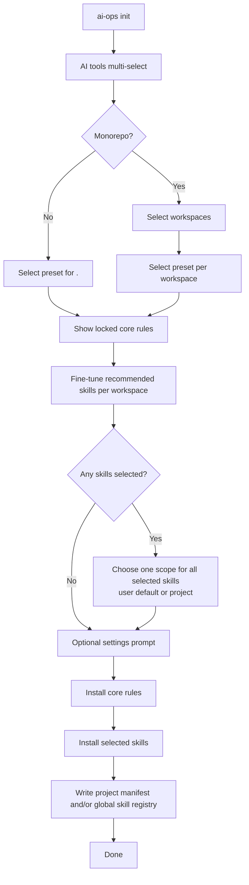

# ai-ops init TUI Flow

## Objective

Document the current `ai-ops init` interaction model after the split between core rules and installable skills.

## Flow

```mermaid
flowchart TD
    Start[ai-ops init] --> Tools[AI tools multi-select]
    Tools --> Monorepo{Monorepo?}

    Monorepo -->|No| SinglePreset[Select preset for .]
    Monorepo -->|Yes| Workspaces[Select workspaces]
    Workspaces --> WorkspacePreset[Select preset per workspace]

    SinglePreset --> CoreRules[Show locked core rules]
    WorkspacePreset --> CoreRules

    CoreRules --> SkillTune[Fine-tune recommended skills per workspace]
    SkillTune --> HasSkills{Any skills selected?}
    HasSkills -->|Yes| SkillScope[Choose one scope for all selected skills\nuser default or project]
    HasSkills -->|No| Settings[Optional settings prompt]
    SkillScope --> Settings

    Settings --> InstallRules[Install core rules]
    InstallRules --> InstallSkills[Install selected skills]
    InstallSkills --> Persist[Write project manifest and/or global skill registry]
    Persist --> Done[Done]
```

## Behavior Notes

- Core rules come from the preset and are not manually fine-tuned in `init`.
- Skills are the only stack-specific items that can be fine-tuned during `init`.
- The skill scope prompt appears only when at least one skill is selected.
- `user` scope is the default and writes to `~/.ai-ops/skills-manifest.json`.
- `project` scope writes installed skill metadata into `.ai-ops-manifest.json`.
- `ai-ops uninstall` removes only project-managed files.
